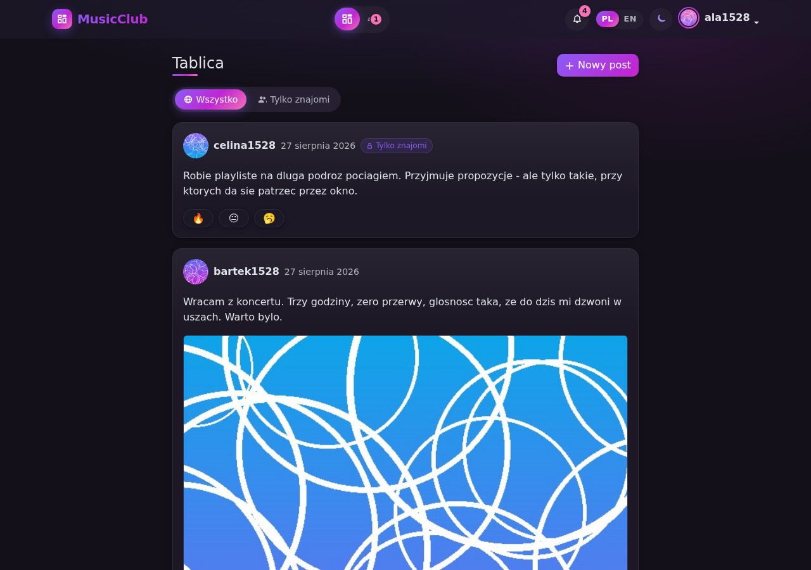
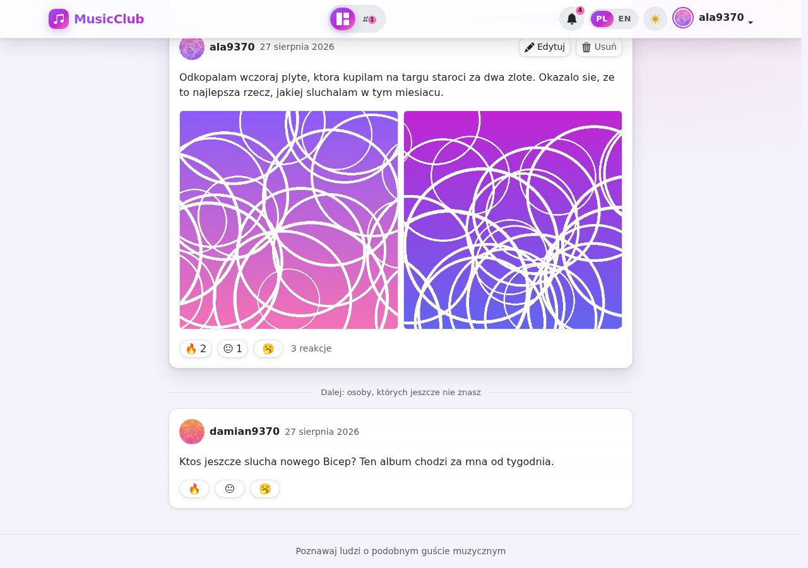
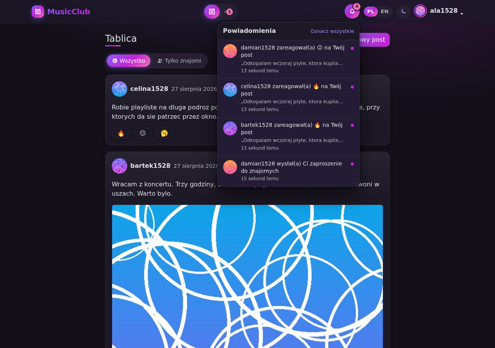
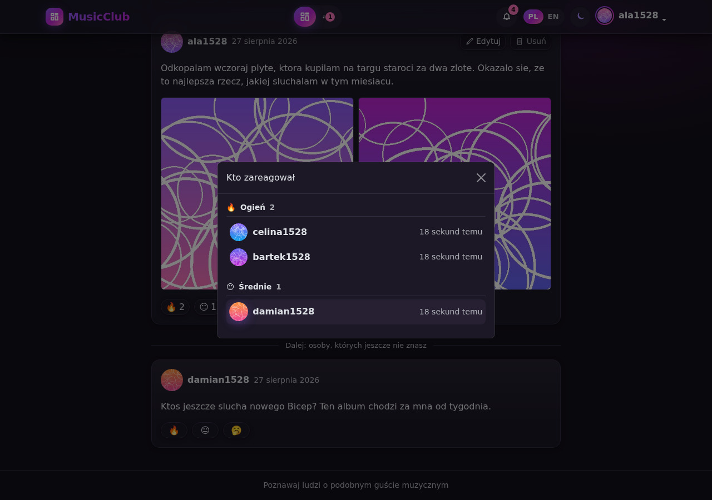
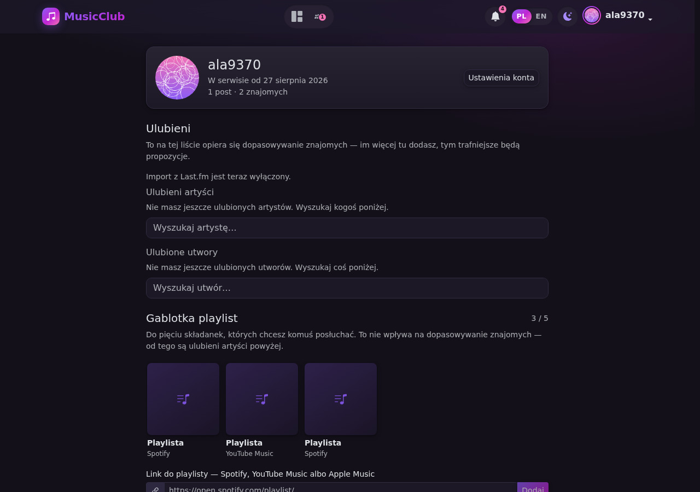
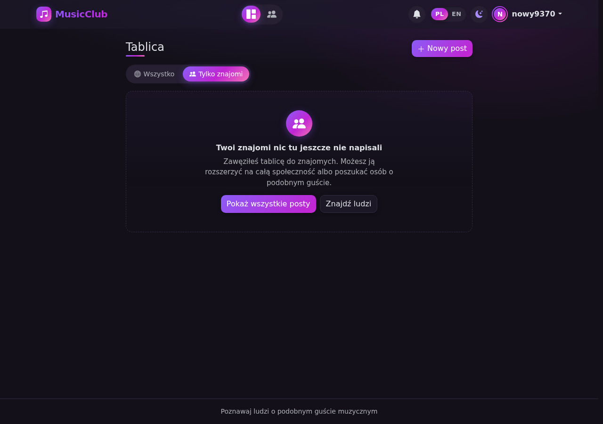
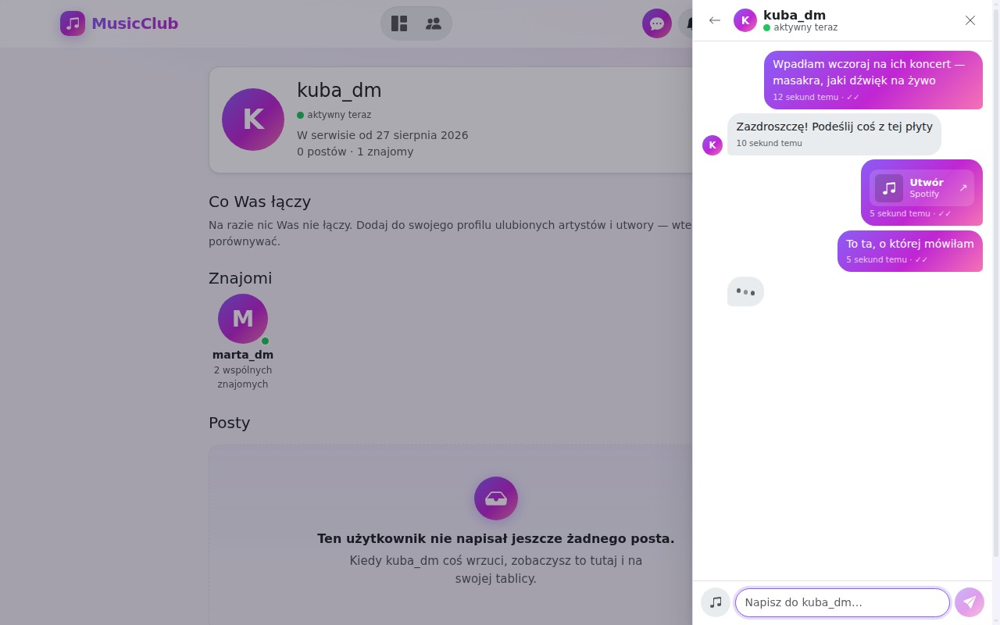
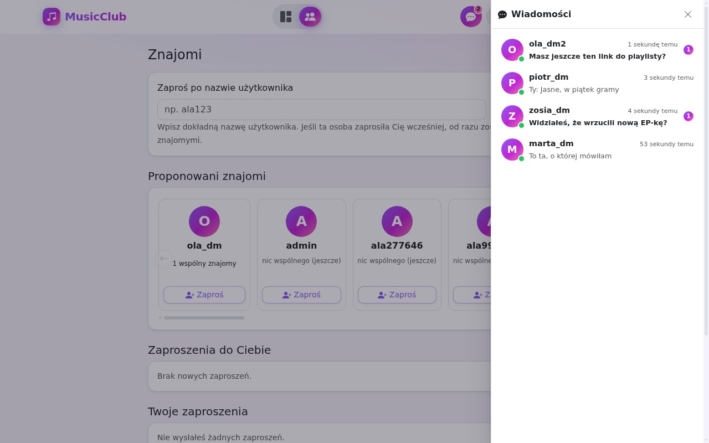
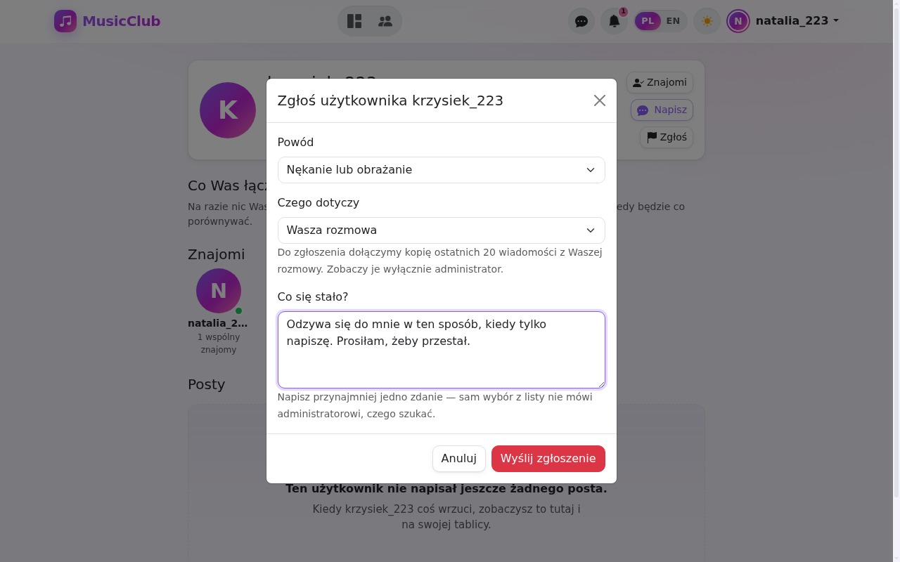
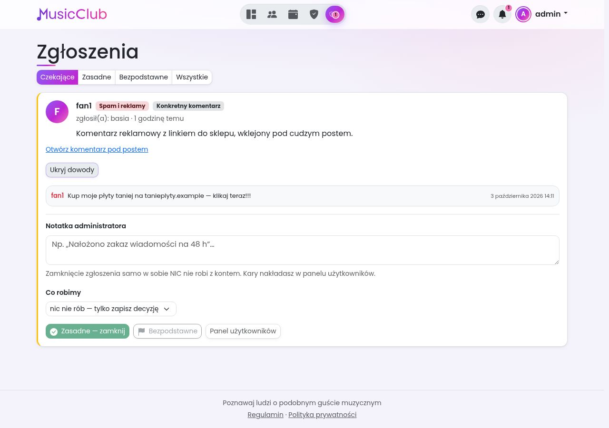

# MusicClubApp

Projekt zaliczeniowy — Programowanie w Javie III.

Aplikacja do poznawania ludzi o podobnym guście muzycznym. Użytkownicy mają
ulubionych artystów i utwory z katalogu Deezera; im więcej wspólnych artystów
i gatunków, tym wyżej ktoś pojawia się na liście proponowanych znajomych. Do
tego posty (tekst, zdjęcie, link do podglądu utworu), konta z logowaniem
i interfejs PL/EN.

**Stack:** Spring Boot 3.3 (REST API) · PostgreSQL 16 · React + Vite · Docker Compose

## Jak to wygląda



Tablica pokazuje **najpierw posty znajomych**, a pod nimi publiczne wpisy
pozostałych osób — granicę widać wyraźnie:



| | |
|---|---|
|  |  |
| Dzwonek — każde powiadomienie prowadzi do konkretnego zdarzenia | Okienko „kto zareagował", pogrupowane po rodzaju |
|  |  |
| Profil: ulubieni, gablotka playlist, znajomi, posty | Pusto ≠ awaria — każdy pusty stan mówi, co dalej |
|  |  |
| Czat wysuwa się z prawej — rozmowa toczy się obok tego, co akurat oglądasz | Lista rozmów: kropka „online", podgląd ostatniej wiadomości, licznik nieprzeczytanych |
|  |  |
| Zgłoszenie wymaga opisania problemu własnymi słowami | Panel administratora z migawką rozmowy — jedyną drogą, żeby ją zobaczyć |

<details>
<summary>Skąd te zrzuty i czego na nich nie ma</summary>

Zrobione **prawdziwą przeglądarką** (Chromium sterowany Playwrightem) na
danych demonstracyjnych zakładanych przez zwykłe API aplikacji — skrypt
`zrzuty-do-readme.mjs`. Zdjęcia w postach to wygenerowane gradienty, a nie
czyjeś fotografie: chodzi o pokazanie układu strony, nie o ilustracje.

Nie ma na nich **odtwarzaczy muzyki ani okładek playlist**. Środowisko,
w którym powstawały, nie ma dostępu do Spotify, YouTube ani Deezera, więc
ramka `<iframe>` zostałaby pusta, a okładki zastąpione są ikoną. U Ciebie,
z normalnym dostępem do sieci, wczytają się same.
</details>

## Dokumentacja

| Plik | Co zawiera |
|------|------------|
| [`docs/PLAN.md`](docs/PLAN.md) | plan pracy krok po kroku + wyjaśnienie, co robi każdy element |
| [`docs/WYMAGANIA.md`](docs/WYMAGANIA.md) | checklista 28 wymagań z PDF-a i gdzie każde realizujemy |

## Jak uruchomić

Potrzebne: **Docker Desktop**. Do pracy nad kodem dodatkowo **JDK 17+**
i **Node 20+**.

### Wariant A — całość jedną komendą (wymaganie nr 18)

```bash
cp .env.example .env      # w PowerShellu: copy .env.example .env
docker compose up -d --build
```

Aplikacja: **http://localhost:3000** · Swagger: http://localhost:8080/swagger-ui.html
· Adminer: http://localhost:8081

Pierwszy start trwa kilka minut (budowanie obrazów). Kolejne są szybkie.
`docker compose down` zatrzymuje wszystko, `docker compose down -v` kasuje
też dane **razem ze wgranymi zdjęciami**.

### Wariant B — do codziennej pracy nad kodem

W wariancie A każda zmiana wymaga przebudowania obrazu. Na co dzień wygodniej:

```bash
# 1. Sama baza
docker compose up -d db

# 2. Backend (da się debugować z IntelliJ)
mvn spring-boot:run

# 3. Frontend (w drugim terminalu)
cd frontend
npm install     # tylko za pierwszym razem
npm run dev
```

Aplikacja: http://localhost:5173 · Backend: http://localhost:8080

Adminer: system `PostgreSQL`, serwer `db`, użytkownik / hasło / baza: `musicclub`

```bash
# Testy - działają nawet przy wyłączonym Dockerze (baza H2 w pamięci)
mvn test
```

## Struktura

```
docker-compose.yml            # KROK 6: baza + backend + frontend + Adminer
Dockerfile                    # obraz backendu (Maven -> JRE)
.env.example                  # wzór pliku z hasłami (skopiuj do .env)
pom.xml                       # zależności Mavena
docs/                         # plan pracy i checklista wymagań
docs/zrzuty/                  # zrzuty ekranu do tego pliku
src/main/java/com/musicclubapp/
├── MusicClubAppApplication.java   # punkt wejścia
├── config/                        # SecurityConfig, I18nConfig
├── controller/                    # REST API (Auth, Post, Reaction, Profile, Users,
│                                  #           Favorites, MusicCatalog, Friend)
├── dto/                           # dane wejściowe/wyjściowe + walidacja
├── entity/                        # encje JPA (klasa = tabela)
├── error/                         # GlobalExceptionHandler i wyjątki
├── mapper/                        # encja → DTO
├── repository/                    # dostęp do bazy (interfejsy Spring Data)
├── security/                      # "zapamiętaj mnie" dla logowania JSON-em
├── service/                       # logika biznesowa
└── validation/                    # własne adnotacje walidacyjne
src/main/resources/
├── application.properties         # konfiguracja (baza, języki, Security)
└── lang/messages*.properties      # teksty PL i EN
src/test/
├── java/                          # @SpringBootTest, @DataJpaTest, @WebMvcTest, Mockito
└── resources/application-test.properties  # profil testowy (H2 w pamięci)

frontend/                        # KROK 5: React + Vite (szczegóły w frontend/README.md)
├── vite.config.js               # proxy /api → localhost:8080 (bez CORS-a)
├── Dockerfile                   # KROK 6: build Vite -> nginx
├── nginx.conf                   # to samo proxy, ale w kontenerze
└── src/
    ├── api/client.js            # axios: ciasteczka, CSRF, język, błędy (sam TRANSPORT)
    ├── api/czat.js, moderacja.js, posty.js, profil.js, znajomi.js,
    │       powiadomienia.js, konto.js, muzyka.js
    │                            # nazwane operacje serwera - oddają gotowe dane
    ├── auth/                    # kto zalogowany + ochrona tras
    ├── theme/                   # motyw jasny/ciemny
    ├── i18n/                    # pl.json i en.json
    ├── hooks/                   # useOdswiezanie - jeden puls dla całej aplikacji
    │                            # useLiveReactions - liczniki reakcji
    ├── components/              # Layout, Post, Reactions, Favorites, Playlists,
    │                            #   CommonGround, EmptyState, PostSkeleton, …
    │                            # Icons.jsx: ikony z Bootstrap Icons (MIT)
    └── pages/                   # Login, Register, Feed (strona główna), Post, Profile,
                                 #   Friends, Settings
```

## API

| Metoda | Ścieżka | Opis |
|--------|---------|------|
| GET | `/api/auth/csrf` | ustawia ciasteczko CSRF (zawołaj przed pierwszym POST) |
| POST | `/api/auth/register` | rejestracja |
| POST | `/api/auth/login` | logowanie (zakłada sesję) |
| POST | `/api/auth/logout` | wylogowanie |
| GET | `/api/auth/me` | dane zalogowanego użytkownika |
| PUT | `/api/profile` | zmiana własnego loginu i e-maila |
| PUT | `/api/profile/password` | zmiana własnego hasła (wymaga obecnego) |
| GET | `/api/posts?scope=ALL\|FRIENDS&sort=RELEVANT\|NEWEST` | tablica — najpierw znajomi, potem reszta: „Dla ciebie” (okolica, gust, popularność; domyślnie) albo od najnowszych |
| POST | `/api/posts` | dodanie posta (tekst + zdjęcia + muzyka + widoczność) |
| PUT | `/api/posts/{id}` | edycja posta (treść, nagranie, widoczność) — **tylko autor** |
| DELETE | `/api/posts/{id}` | usunięcie posta (autor albo admin) |
| GET | `/api/posts/{id}` | jeden post — tu prowadzą powiadomienia o reakcjach |
| GET | `/api/posts/reactions?ids=` | same liczniki reakcji dla wskazanych postów |
| PUT | `/api/posts/{id}/reaction` | ustawia reakcję (`FIRE`, `MID`, `MEH`) |
| DELETE | `/api/posts/{id}/reaction` | cofa własną reakcję |
| GET | `/api/posts/{id}/reactions` | kto zareagował i jak |
| GET | `/api/notifications` | powiadomienia, od najnowszych |
| GET | `/api/notifications/unread-count` | liczba nieprzeczytanych (to ona wisi przy dzwonku) |
| POST | `/api/notifications/{id}/read` | oznacza jedno jako przeczytane |
| POST | `/api/notifications/read-all` | oznacza wszystkie |
| DELETE | `/api/notifications/{id}` | usuwa jedno powiadomienie |
| GET | `/api/messages/conversations` | wszyscy znajomi z ostatnią wiadomością i licznikiem |
| GET | `/api/messages/unread-count` | liczba nieprzeczytanych (to ona wisi przy ikonie czatu) |
| GET | `/api/messages/with/{username}` | historia rozmowy, od najnowszej |
| POST | `/api/messages/with/{username}` | wysłanie wiadomości (tekst i/albo nagranie) |
| GET | `/api/messages/with/{username}/sync?after=` | nowe wiadomości + „pisze" + obecność, jedną odpowiedzią |
| POST | `/api/messages/with/{username}/read` | oznacza rozmowę jako przeczytaną |
| POST | `/api/messages/with/{username}/typing` | sygnał „właśnie piszę" (żyje 5 s, w pamięci) |
| POST | `/api/reports/on/{username}` | zgłasza użytkownika (powód, kontekst, opis) |
| GET | `/api/reports/mine` | **moje** zgłoszenia razem z decyzją i notatką administratora |
| DELETE | `/api/profile` | kasuje **własne konto** — wymaga hasła w treści |
| DELETE | `/api/profile/posts` | kasuje **wszystkie własne posty** — wymaga hasła w treści |
| DELETE | `/api/messages/with/{username}` | usuwa rozmowę **tylko u siebie** |
| GET | `/api/reports/admin?status=` | lista zgłoszeń — **tylko administrator** |
| GET | `/api/reports/admin/{id}` | jedno zgłoszenie z migawką dowodów |
| GET | `/api/reports/admin/open-count` | ile czeka na decyzję (liczba przy ikonie) |
| POST | `/api/reports/admin/{id}/resolve` | zamyka zgłoszenie decyzją i notatką, wykonując wybrane działanie (kara, usunięcie posta lub konta, albo nic) |
| POST | `/api/reports/admin/{id}/reopen` | otwiera zamkniętą sprawę, żeby zdecydować inaczej |
| GET | `/api/users/{id}/addresses` | adresy, z których logowało się konto |
| GET | `/api/users/{id}/related` | inne konta z tych samych adresów (**poszlaka**) |
| GET | `/api/users/blocked-ips` | lista zablokowanych adresów |
| POST | `/api/users/blocked-ips` | blokuje adres (rejestracja i logowanie) |
| DELETE | `/api/users/blocked-ips/{id}` | zdejmuje blokadę adresu |
| GET | `/api/profiles/{username}` | publiczny profil użytkownika |
| GET | `/api/profiles/{username}/friends` | znajomi — od najbardziej powiązanych |
| GET | `/api/profiles/{username}/top-music` | najczęściej wrzucane nagrania (top 5) |
| GET | `/api/profiles/{username}/favorites` | czyjeś ulubione — do oglądania |
| GET | `/api/profiles/{username}/common` | co konkretnie łączy Cię z tą osobą |
| GET | `/api/profiles/{username}/playlists` | czyjaś gablotka playlist |
| GET | `/api/profile/playlists` | **moja** gablotka playlist |
| POST | `/api/profile/playlists` | dodanie playlisty (w treści sam adres) |
| DELETE | `/api/profile/playlists/{id}` | usunięcie playlisty z gablotki |
| GET | `/api/profile/favorites` | **moje** ulubione |
| POST | `/api/profile/favorites/artists` | dodanie artysty z katalogu (w treści sam `externalId`) |
| DELETE | `/api/profile/favorites/artists/{externalId}` | usunięcie artysty z własnej listy |
| POST | `/api/profile/favorites/tracks` | dodanie utworu z katalogu |
| DELETE | `/api/profile/favorites/tracks/{externalId}` | usunięcie utworu z własnej listy |
| GET | `/api/profile/favorites/import/lastfm` | czy import jest włączony (czy jest klucz API) |
| POST | `/api/profile/favorites/import/lastfm` | import z Last.fm po nazwie użytkownika |
| GET | `/api/music/search/artists?q=` | wyszukiwarka artystów (Deezer) |
| GET | `/api/music/search/tracks?q=` | wyszukiwarka utworów (Deezer) |
| GET | `/api/friends/suggestions` | proponowani znajomi — od najlepiej dopasowanych (gust, wspólni znajomi, a przy ustawionym mieście także okolica) |
| GET | `/api/friends/requests` | zaproszenia oczekujące (do mnie i ode mnie) |
| POST | `/api/friends/requests` | zaproszenie do znajomych |
| POST | `/api/friends/requests/{id}/accept` | przyjęcie zaproszenia |
| DELETE | `/api/friends/requests/{id}` | odrzucenie albo anulowanie |
| DELETE | `/api/friends/{username}` | usunięcie znajomości |
| PUT | `/api/profile/avatar` | wgranie zdjęcia profilowego |
| DELETE | `/api/profile/avatar` | usunięcie zdjęcia profilowego |
| GET | `/api/users` | lista ze stronicowaniem i sortowaniem — **tylko admin** |
| GET | `/api/users/{id}` | pojedynczy użytkownik — **tylko admin** |
| PATCH | `/api/users/{id}/role` | zmiana roli — **tylko admin** |
| PATCH | `/api/users/{id}/bans/{kind}` | kara `POSTING` albo `MESSAGING` na N godzin, bezterminowo lub pusto = zdejmij — **tylko admin** |
| DELETE | `/api/users/{id}` | usunięcie konta wraz z jego treściami — **tylko admin** |
| GET | `/actuator/health` | czy aplikacja żyje — używa tego healthcheck Dockera |

### Nowsze punkty API

Wydarzenia, konto, prywatność, klany i powiadomienia na telefon. Pełna lista
z opisami: Swagger (adres niżej).

| Metoda | Ścieżka | Opis |
|--------|---------|------|
| GET | `/api/events?view=&city=&q=&radius=` | lista wydarzeń (`FOR_YOU`, `UPCOMING`, `MINE`); `radius` (km) zawęża do okolicy miasta z profilu |
| GET | `/api/events/{id}` | wydarzenie z uczestnikami i powodami „Dla ciebie” |
| PUT / DELETE | `/api/events/{id}/participation` | „Zainteresowany” / „Biorę udział” / rezygnacja |
| GET | `/api/posts?event={id}` | posty pod wydarzeniem („szukam ekipy”) |
| GET / POST | `/api/posts/{id}/comments` | komentarze pierwszego poziomu (od najnowszych, `page`, `size`) / dodanie komentarza lub odpowiedzi (`content`, `parentId`) |
| GET | `/api/comments/{id}` / `/api/comments/{id}/replies` | jeden komentarz (tu prowadzą powiadomienia) / odpowiedzi pod nim, od najstarszej |
| DELETE | `/api/comments/{id}` | usunięcie komentarza: autor, autor posta, administrator albo — w poście klanu — zarząd klanu |
| GET | `/api/posts/{id}/mentionable?q=` | podpowiedzi osób do oznaczenia (`@login`) pod tym postem |
| GET | `/api/gifs/status` | czy GIF-y są włączone i czyim logiem je podpisać („Powered by …”) |
| GET | `/api/gifs/search?q=&pos=&limit=` | przeglądarka GIF-ów: szuka u dostawcy (pusta fraza = popularne); wyniki mają podpisany `token`, który wysyła się w polu `gif` komentarza (`POST /api/posts/{id}/comments`) albo wiadomości (`POST /api/messages/with/{login}`) |
| POST | `/api/auth/verify-email` | potwierdzenie adresu z linku w wiadomości |
| POST | `/api/auth/password-reset/request` | prośba o reset hasła (zawsze 204) |
| POST | `/api/auth/password-reset/confirm` | nowe hasło z linku |
| GET / PUT | `/api/profile/privacy` | ustawienia prywatności (profil, zaproszenia, aktywność, klany, pokazywanie miasta) |
| PUT | `/api/profile/location` | miasto w profilu (pusty tekst je usuwa) |
| GET | `/api/cities?q=` | podpowiedzi miast do pola „Miasto” |
| PUT / DELETE | `/api/blocks/{username}` | blokada osoby / odblokowanie |
| GET / POST | `/api/profile/terms`, `/api/profile/terms/accept` | wersja regulaminu na koncie i jej akceptacja |
| POST | `/api/profile/export` | archiwum ZIP z własnymi danymi — wymaga hasła |
| GET | `/api/public/info` | co wiadomo przed zalogowaniem: poczta, wersja regulaminu, administrator danych |
| GET | `/api/push` | czy działa push, klucz serwera, przypomnienia, liczba urządzeń |
| POST / DELETE | `/api/push/subscriptions` | zapis / wypisanie urządzenia z powiadomień |
| POST | `/api/push/test` | próbne powiadomienie |
| GET | `/api/clans/mine` | mój klan i zaproszenia do klanów |
| POST | `/api/clans` | założenie klanu |
| GET / PUT / DELETE | `/api/clans/{id}` | strona klanu / zmiana / rozwiązanie |
| POST | `/api/clans/{id}/invitations` | zaproszenie do klanu |
| GET | `/api/clans/directory` | przeglądarka klanów: `q`, `genre`, `city`, `joinable`, `radius`, `sort` (MATCH, NEAREST, MEMBERS, ACTIVE, NEWEST, OLDEST, NAME), `page`, `size` |
| POST / DELETE | `/api/clans/{id}/requests`, `/requests/mine` | prośba o dołączenie (klan musi przyjmować prośby) / jej cofnięcie |
| POST | `/api/clans/{id}/requests/{requestId}/accept`, `/decline` | rozpatrzenie prośby — zarząd klanu |
| POST | `/api/clans/invitations/{id}/accept`, `/decline` | przyjęcie / odmowa zaproszenia |
| DELETE | `/api/clans/{id}/members/me`, `/members/{username}` | odejście / wyrzucenie |
| PUT | `/api/clans/{id}/color` | mój głos na kolor klanu |
| GET / POST | `/api/clans/{id}/chat` | czat klanu (`after=`, `before=`) |
| POST / PUT | `/api/clans/{id}/chat/read`, `/chat/mute` | „przeczytane do” (licznik nieprzeczytanych) / wyciszenie powiadomień z czatu |
| GET | `/api/clans/mine/unread` | ile nieprzeczytanych wiadomości czeka w moim klanie |
| PUT / DELETE | `/api/clans/{id}/chat/{messageId}/reaction` | reakcja emoji na wiadomość (jedna na osobę) |
| GET | `/api/clans/{id}/chat/reactions?since=` | reakcje pod wiadomościami od podanej wzwyż |
| GET | `/api/clans/{id}/taste` | gust klanu: wykonawcy i gatunki wspólne dla co najmniej dwóch osób (dla obcych — tylko klany z przeglądarki) |
| GET | `/api/clans/{id}/activity?period=WEEK\|ALL` | ranking aktywności i cel tygodnia — tylko członkowie |
| POST / PUT / DELETE | `/api/clans/{id}/titles[/{titleId}]` | tytuły klanu: dodanie, zmiana, usunięcie — zarząd |
| PUT / DELETE | `/api/clans/{id}/members/{username}/titles/{titleId}` | nadanie / zdjęcie tytułu — zarząd |
| PUT / DELETE | `/api/clans/{id}/titles/{titleId}/claim` | wzięcie / oddanie tytułu „do wzięcia samemu” |
| GET / POST | `/api/clans/{id}/polls` | ankiety klanu |
| PUT / DELETE | `/api/clans/{id}/polls/{pollId}/vote` | głos w ankiecie / jego cofnięcie |
| POST / DELETE | `/api/clans/{id}/polls/{pollId}/close`, `…/polls/{pollId}` | zamknięcie / usunięcie ankiety — autor albo zarząd |
| GET / POST | `/api/clans/{id}/tracks` | utwór tygodnia: propozycje i zwycięzcy / nowa propozycja |
| PUT / DELETE | `/api/clans/{id}/tracks/{trackId}/vote`, `DELETE …/tracks/{trackId}` | głos na propozycję / jego cofnięcie, usunięcie propozycji |
| GET | `/api/clans/{id}/events` | koncerty, na które zapisali się członkowie klanu |
| POST | `/api/reports/clans/{id}` | zgłoszenie klanu (nazwa, skrót, opis, obrazy) |
| GET | `/api/posts?clan={id}` | posty klanu — tylko członkowie i administrator aplikacji |

Dokumentacja: http://localhost:8080/swagger-ui.html

## Role i konto administratora

Rejestracja przez formularz zawsze tworzy **zwykłego użytkownika** — inaczej
każdy mógłby zrobić sobie konto administratora. Pierwszego admina zakłada więc
sama aplikacja przy pierwszym starcie (`config/AdminInitializer`), o ile w bazie
nie ma jeszcze żadnego.

Domyślne dane logowania: **`admin` / `admin12345`** — do nauki. Przed oddaniem
projektu ustaw własne przez zmienne środowiskowe `ADMIN_USERNAME`,
`ADMIN_EMAIL`, `ADMIN_PASSWORD` albo po prostu zmień hasło w ustawieniach konta.

| Kto | Widzi |
|-----|-------|
| zwykły użytkownik | swój profil, ustawienia konta (login, e-mail, hasło) |
| administrator | to samo + listę wszystkich kont, zmianę ról, usuwanie cudzych postów, **zakaz publikowania i usuwanie kont** |

### Moderacja: zakaz publikowania i usuwanie kont

W panelu administratora, przy każdym koncie poza własnym, są dwie rzeczy:
**zakaz publikowania** (godzina / doba / tydzień / miesiąc) i **usunięcie konta**.

**Zakaz ma termin, a nie flagę „zablokowany".** Blokada bezterminowa
wymagałaby, żeby ktoś pamiętał o jej zdjęciu — a o tym zwykle nikt nie
pamięta. Zapisany termin sam pilnuje końca kary: wygasa bez żadnego zadania
w tle, bo liczy się wyłącznie porównanie z bieżącą chwilą. Wpisu nie
kasujemy, więc administrator widzi, że ktoś był już kiedyś karany.

Zakaz obejmuje **dodawanie i edytowanie postów**. Czytanie, reakcje
i usuwanie własnych treści zostają dozwolone — kara ma powstrzymać przed
publikowaniem, a nie odciąć od portalu. (Edycja też jest zablokowana celowo:
inaczej wystarczyłoby wejść w dowolny stary post i podmienić w nim treść.)
Ukarany widzi komunikat z **terminem** końca kary, a nie samo „nie wolno".

**Usunięcie konta zabiera ze sobą wszystko**: posty (razem ze zdjęciami
na dysku), reakcje pod cudzymi postami, zaproszenia w obie strony,
znajomości i awatar. Cudze posty, pod którymi ta osoba zostawiła reakcję,
zostają — usuwamy konto, a nie fragmenty cudzych rozmów.

Dwie rzeczy administrator ma zablokowane **na sobie**: usunięcie własnego
konta i nałożenie na siebie zakazu. Powód jest ten sam co przy zmianie
własnej roli — jedno kliknięcie nie może zostawić portalu bez nikogo,
kto ma do niego dostęp.

Uwaga na dwie podobne ścieżki: `/api/profile` (l. poj.) to **moje** konto —
zmiana loginu, e-maila, hasła, awatara. `/api/profiles/{username}` (l. mn.)
to **czyjś** profil do oglądania: sam login, awatar, data dołączenia i liczba
postów. Publiczny profil celowo **nie zawiera e-maila ani roli** — to osobne
DTO, a nie ten sam obiekt z wyciętymi polami.

## Muzyka w postach

Post może mieć podpięte nagranie ze **Spotify**, **YouTube Music**
albo **Apple Music**. W formularzu wybierasz przełącznikiem, co wrzucasz:

| Rodzaj | Spotify | YouTube Music | Apple Music | Moment startu |
|---|---|---|---|---|
| Utwór | ✅ | ✅ | ✅ | ✅ opcjonalny |
| Album | ✅ | (jako playlista) | ✅ | — |
| Artysta | ✅ | — | ✅ | — |
| Playlista | ✅ | ✅ | ✅ | — |

**Zły link zatrzymuje wysyłkę**, zamiast zostać po cichu połkniętym — a komunikat
mówi, *co* wkleiłeś („to jest link do ALBUMU"), a nie tylko „zły link". Pole
momentu startu **pokazuje się wyłącznie przy utworze**: album to wiele nagrań,
a profil artysty w ogóle nie jest nagraniem.

### Tylko YouTube Music, nie zwykły YouTube

Przyjmujemy **wyłącznie `music.youtube.com`**. Link z `youtube.com/watch`
i skrócony `youtu.be` są odrzucane z podpowiedzią, co zrobić („otwórz to
nagranie w YouTube Music i skopiuj adres stamtąd"). Powód jest prosty: to
serwis **muzyczny**, a zwykły YouTube to wszystko — od podcastów po vlogi.
Statystyki gustu i dopasowywanie znajomych opierają się na tym, co ludzie
wrzucają, więc wpuszczenie tam dowolnego filmu zamieniłoby je w szum.

Uwaga na kolejność sprawdzania: `music.youtube.com` **zawiera w sobie**
`youtube.com`, więc najpierw pytamy o YT Music, a dopiero potem odrzucamy
resztę. Odwrotna kolejność odrzucałaby też te dobre linki.

Sam odtwarzacz składamy przez `youtube.com/embed/` — identyfikator nagrania
jest ten sam w obu serwisach. **YT Music dostaje duży ekran 16:9**, a nie
wąski pasek jak Spotify: pod tym adresem leci normalne nagranie z obrazem
i teledysk schowany w pasku wysokości 152 px nie miałby sensu.

Album udostępniony z YouTube Music przychodzi jako `playlist?list=OLAK5uy_…`
i tak też go zapisujemy: jako **playlistę**, bo tym on tam formalnie jest.

**Playlisty nie wliczają się do statystyk gustu** — playlista to cudza składanka,
a nie deklaracja „lubię tego artystę". Wrzucić ją na tablicę można, ale
w podsumowaniu profilu się nie pojawia.

### Skąd bierzemy tytuł

Tytuł i miniaturkę pobieramy **raz, przy dodawaniu posta**, przez publiczne
**oEmbed** — bez klucza i bez tokenu, więc działa dla każdego użytkownika.
Gdy serwis nie odpowie, post i tak powstaje: odtwarzacz ładuje się
w przeglądarce niezależnie od tego.

Apple Music **nie ma publicznego oEmbed**, ale ma tytuł **w samym adresie**:
w `music.apple.com/pl/song/lullaby/1440786034` człon `lullaby` to nazwa
utworu. Zamieniamy myślniki na spacje i podnosimy pierwsze litery — wychodzi
„Lullaby". To nie jest zgadywanie: ten człon generuje sam Apple z prawdziwej
nazwy nagrania.

Jest jeden wyjątek, w którym tego **nie** robimy. Adres z parametrem `?i=`
(utwór wskazany wewnątrz albumu) ma w slugu nazwę **albumu**, a nie utworu —
podpisanie takiego posta nazwą albumu byłoby zwykłym błędem, więc wtedy
zostawiamy puste pole. Lepsze puste niż mylące.

Na profilu widać **najczęściej wrzucane utwory** — liczone z postów, nie
z osobnej tabeli statystyk, więc licznik nie ma jak rozjechać się
z rzeczywistością.

## Ulubieni artyści i utwory

Na profilu jest sekcja **Ulubieni** — to świadoma deklaracja gustu i to na
niej opiera się dopasowywanie ludzi. Blok obok („najczęściej wrzucane") mówi
co innego: co ktoś *postuje*, a to nie zawsze to samo, co lubi.

**Dodać da się tylko to, co istnieje w katalogu Deezera.** Nie ma pola „wpisz
nazwę artysty" i nie jest to przeoczenie — bez tego lista ulubionych byłaby
polem do popisu dla wymyślonych zespołów. Wpisujesz frazę, dostajesz
podpowiedzi z katalogu i klikasz w jedną z nich.

Ochrona nie kończy się na formularzu. Zapytanie da się wysłać z pominięciem
przeglądarki, więc metody serwisu przyjmują **wyłącznie identyfikator** —
nazwy ani zdjęcia nie ma jak przysłać, serwer pobiera je sobie sam z katalogu.
Pilnuje tego test `FavoritesServiceTest#serverDoesNotTrustNameFromRequest`.

Wiersz w tabeli `artists` jest **wspólny dla wszystkich** — polubienie tego
samego wykonawcy przez drugą osobę to samo dopisanie powiązania, bez ani
jednego zapytania do sieci. Usunięcie z ulubionych kasuje **tylko
powiązanie**; sam artysta zostaje, bo mają go u siebie inni.

Domyślny limit to **30 artystów i 30 utworów** (`app.favorites.max-artists`,
`app.favorites.max-tracks`).

### Import z Last.fm

Jeśli w `.env` jest `LASTFM_API_KEY`, na profilu pojawia się przycisk
**Import z Last.fm**: podajesz swoją nazwę użytkownika stamtąd i aplikacja
zaciąga najczęściej słuchanych artystów i utwory.

**Bez klucza przycisku nie ma** — to lepsze niż przycisk, który zawsze kończy
się błędem. Sam brak przycisku nie jest jednak informacją, tylko zagadką,
więc na własnym profilu widać wtedy krótką notkę, że import jest wyłączony;
**administrator dostaje dodatkowo nazwę zmiennej**, bo tylko on może to
włączyć. Klucz zakłada się w minutę na
<https://www.last.fm/api/account/create> — wystarczy sam „API key".

Podział ról między serwisami jest celowy: **Last.fm mówi, *czego* ktoś
słucha** (samych nazw — ich API od 2019 roku nie oddaje użytecznych zdjęć),
a **Deezer mówi, *kto* to jest** — identyfikator, zdjęcie, pewność, że taki
wykonawca istnieje. Czego nie da się odnaleźć w katalogu, tego nie dodajemy,
a podsumowanie po imporcie mówi wprost, ile pozycji pominięto i dlaczego.

Konta Last.fm **nie podpinamy** — nie ma logowania OAuth, nie trzymamy żadnego
tokenu. Wystarczy publiczna nazwa użytkownika, bo historia słuchania jest tam
publiczna.

Gatunki artysty bierzemy z tagów Last.fm, ale **tagi to nie są gatunki** —
wśród najpopularniejszych są „seen live" i „favorites". Odsiewamy je listą
wykluczeń i progiem popularności, inaczej dopasowanie łączyłoby ludzi na
zasadzie „oboje byli na jakimś koncercie". Gatunki zapisujemy **przy artyście,
nie przy użytkowniku**, więc kosztują jedno zapytanie na wykonawcę — raz,
na zawsze, dla wszystkich.

## Kto co widzi: tablica i widoczność postów

Dwie osobne rzeczy, które łatwo pomylić.

**Widoczność** ustawia autor przy pisaniu: post jest *publiczny* albo *tylko
dla znajomych*. **Kolejność** ustala aplikacja: posty z Twojego kręgu
(znajomi i Ty) idą na górę, publiczne wpisy pozostałych osób pod nie.
Nad tablicą jest przełącznik, którym można zawęzić ją do samych znajomych.

### Tablica „Dla ciebie” — kolejność postów obcych

Krąg znajomych jest zawsze na górze i zawsze od najnowszych. Posty osób
spoza kręgu ma porządkować to, co interesuje *ciebie*, a nie sam zegar —
inaczej tablica pełna jest świeżych, ale przypadkowych wpisów z drugiego końca
kraju. `FeedRanker` liczy dla każdego posta:

```
ocena = świeżość × (0,4 + okolica + gust + popularność)
```

- **świeżość** maleje o połowę co 72 godziny i *mnoży* resztę, więc kolejność
  dwóch postów zależy tylko od różnicy ich wieku — nie zmienia się między
  pobraniem pierwszej a drugiej strony (stronicowanie nie kłamie);
- **okolica** — poziom bliskości miast autora i oglądającego (0–5, ta sama
  skala co w propozycjach, wydarzeniach i klanach; waga 1,0);
- **gust** — wspólni ulubieni wykonawcy (3 pkt) i gatunki (1 pkt), 10 pkt to
  maksimum (waga 0,7); liczymy tylko z profili widocznych dla wszystkich;
- **popularność** — reakcje + 2 × komentarze, tłumione logarytmem (waga 0,6).

Przy poście stoi powód, dla którego jest wysoko („Z twojej okolicy”,
„Podobny gust”, „Popularne”), a przełącznik „Dla ciebie / Najnowsze” zostaje
zapamiętany w przeglądarce. Okolica zmienia tylko *kolejność* — nikogo nie
wyklucza; „z twojej okolicy” widać przy poście tylko wtedy, gdy autor pokazuje
swoje miasto.

Ranking liczy się w Javie na **puli 300 najnowszych publicznych postów obcych**
(`app.feed.pool-size`); starsze idą za nią od najnowszych, więc tablica się nie
urywa. Jest to świadomy kompromis wobec zasady z następnego akapitu: zapytanie
SQL nie umie ocenić wspólnego gustu, a pula jest stała i krótka, więc strony
nadal się nie powtarzają (zapewnia to `FeedPaginationTest`).

### Kolejność w kręgu liczy baza, nie przeglądarka

Nowe konto nie ma ani jednego znajomego. Aplikacja, która wita takiego
użytkownika pustą stroną, jest bezużyteczna dokładnie wtedy, kiedy najbardziej
potrzebuje go przekonać — dlatego tablica domyślnie pokazuje też ludzi
spoza kręgu, a **nowy post domyślnie jest publiczny**. Cały sens tej
aplikacji to poznawanie *nowych* osób o podobnym guście; domyślne ukrywanie
wpisów przed wszystkimi poza obecnymi znajomymi działałoby przeciwko temu,
po co ona w ogóle jest. Kto chce inaczej, wybiera to jednym kliknięciem.

### Kolejność liczy baza, nie przeglądarka

W zapytaniu siedzi `ORDER BY CASE WHEN autor ∈ mój_krąg THEN 0 ELSE 1 END,
data DESC` — sortujemy po kolumnie, której w tabeli nie ma. Kuszące byłoby
pobrać wszystko i poprzestawiać w Reakcie, ale wtedy **stronicowanie zaczyna
kłamać**: każda strona zawierałaby inny zestaw wpisów, a licznik stron
liczyłby coś zupełnie innego niż to, co widać.

„Mój krąg" to jedno pojęcie (`UserRepository.circleIds`) załatwiające trzy
sprawy naraz: kogo posty idą na górę, czyje posty „tylko dla znajomych" wolno
mi zobaczyć i co zostaje po zawężeniu tablicy. Gdyby liczyły się osobno,
mogłyby się rozjechać. **Własny identyfikator jest w tym zbiorze celowo** —
merytorycznie, bo własne posty należą do kręgu, i technicznie, bo `IN ()`
z pustą listą jest w SQL-u błędem składni i wywracałoby tablicę
użytkownikowi bez znajomych.

### Ta sama reguła w dwóch miejscach

„Kto może zobaczyć post" jest zapisane **dwa razy**: w JPQL-u dla całej
tablicy i w Javie (`Post.isVisibleTo`) dla pojedynczego posta. Nie da się
tego uniknąć — bazę trzeba odsiać u niej, a pojedynczy post sprawdza się
w kodzie. Da się za to sprawdzić, że oba zapisy mówią to samo, i robi to
test `PostVisibilityTest#theRuleInJavaAndInTheDatabaseAgree`.

Reguła obowiązuje **wszędzie**, nie tylko na tablicy: wpisanie z ręki adresu
`/post/{id}` cudzego posta dla znajomych kończy się odmową, tak samo jak
próba zareagowania na niego z pominięciem przeglądarki. Ukrycie czegoś
w interfejsie nie jest zabezpieczeniem.

**Administrator też nie widzi cudzych postów dla znajomych.** To nie jest
przeoczenie: interfejs obiecuje „tylko znajomi", a obietnica z cichym
wyjątkiem dla obsługi serwisu nie jest obietnicą. Moderacja przez usunięcie
posta po identyfikatorze działa niezależnie od tego.

## Powiadomienia

Dzwonek w pasku z liczbą nieprzeczytanych. Powiadamiamy o trzech rzeczach:
ktoś **zareagował na Twój post**, ktoś **wysłał Ci zaproszenie**, ktoś
**przyjął Twoje zaproszenie**.

**Każde powiadomienie można usunąć** — krzyżykiem po prawej, widocznym pod
kursorem (na dotyku: zawsze). To co innego niż „przeczytane": przeczytane gasi
kropkę, ale wpis zostaje na liście i przy kilkudziesięciu powiadomieniach nowe
giną wśród starych. „Przeczytane" mówi *widziałem*, usunięcie — *załatwione,
nie chcę tego więcej oglądać*. Dwie różne rzeczy, więc dwa osobne przyciski.

**Każde powiadomienie gdzieś prowadzi** — i to jest w nich najważniejsze.
Powiadomienie, po którym trzeba samemu szukać, co się właściwie stało,
łatwiej zignorować niż obsłużyć:

| Zdarzenie | Klik prowadzi do |
|---|---|
| reakcja na Twój post | **tego konkretnego posta** (`/post/{id}`) |
| nowe zaproszenie | strony znajomych, gdzie się je przyjmuje |
| przyjęte zaproszenie | profilu tej osoby |
| komentarz pod Twoim postem, odpowiedź na Twój komentarz, oznaczenie w komentarzu | **posta z podświetlonym komentarzem** (`/post/{id}?komentarz={id}`) |

Adres wylicza **serwer** (pole `link`), a nie frontend. Gdyby robił to
frontend, przy każdym nowym rodzaju powiadomienia trzeba by pamiętać
o dopisaniu warunku w drugim miejscu — i prędzej czy później powstałoby
powiadomienie, które nigdzie nie prowadzi.

Trzy reguły, bez których dzwonek szybko przestałby cokolwiek znaczyć:

- **Reakcja na własny post nie powiadamia.** Wiadomo, co się samemu zrobiło.
- **Zmiana zdania odświeża wpis zamiast dokładać drugi.** Jedna osoba
  klikająca kolejno trzy emotki zostawia jedno powiadomienie, nie trzy.
- **Cofnięta reakcja zabiera swoje powiadomienie.** Inaczej klik prowadziłby
  do posta, pod którym nie ma po niej śladu. Tak samo znika powiadomienie
  o zaproszeniu, które zostało odrzucone albo przyjęte.

Powiadomienie o reakcji pokazuje **początek treści posta** — bez tego
wszystkie wyglądałyby tak samo i nie dałoby się poznać, którego dotyczą.

### Kto zareagował

Kliknięcie w podsumowanie pod postem („3 reakcje") otwiera okienko z listą
osób, pogrupowaną po rodzaju reakcji. Listę pobieramy **dopiero po
otwarciu** — gdyby każdy post na tablicy ciągnął ją od razu, dwadzieścia
postów oznaczałoby dwadzieścia dodatkowych zapytań po to, żeby pokazać coś,
w co prawie nikt nie kliknie.

Widzi to każdy, nie tylko autor posta: reakcja jest gestem publicznym,
a i tak dałoby się ją policzyć z licznika obok emotki.

### Liczniki reakcji odświeżają się same

Po powrocie do karty przeglądarki (i co 45 sekund, gdy karta jest na wierzchu)
tablica pobiera **same liczniki** dla postów, które są akurat na ekranie —
jednym zapytaniem `GET /api/posts/reactions?ids=…`.

Dwie rzeczy, których świadomie tu nie robimy. **Nie ma WebSocketa**: stałe
połączenie plus rozgłaszanie zdarzeń po stronie serwera to spory kawałek
maszynerii do utrzymania, a chodzi o kilka liczb pod postami. **Nie
pobieramy tablicy od nowa**: doszłyby nowe posty, kolejność by się zmieniła
i czytający straciłby miejsce, w którym był. Zegar chodzi tylko przy
widocznej karcie — zapytania wysyłane do zminimalizowanego okna nikomu nic
nie pokazują, a zużywają baterię.

## Komentarze pod postami

Pod każdym postem jest sekcja komentarzy (otwierana przyciskiem „Skomentuj”).
Komentarze są jednopoziomowe: odpowiedź na odpowiedź wisi pod tym samym
komentarzem nadrzędnym, z oznaczeniem osoby, do której jest (`reply_to`) —
głębokie drzewka są nieczytelne na telefonie.

- **Oznaczanie.** Wpisanie `@` otwiera listę osób, które można oznaczyć pod tym
  postem: autor posta, osoby, które już tu pisały, i znajomi — tylko takie,
  które widzą post i nie mają blokady z piszącym ani z autorem posta. Obcych,
  których piszący nie zna z tej rozmowy, nie podpowiadamy (nie ma wyszukiwarki
  kont przez komentarze). Serwer sam wyłuskuje `@login` z treści (do 5 osób na
  komentarz; kropka lub myślnik na końcu to interpunkcja) i zapisuje tylko
  tych, których faktycznie można oznaczyć — przeglądarka podświetla wyłącznie
  oznaczenia potwierdzone przez serwer.
- **Kto co widzi.** Komentarze widzą ci, którzy widzą post; pod postem klanu
  — członkowie i administrator aplikacji (obcy dostaje 404, tak jak przy samym
  poście), a w poście klanu piszą tylko członkowie. Komentarze osób z blokad
  oglądającego znikają razem z odpowiedziami pod nimi.
- **Powiadomienia** (dzwonek i push): odpowiedź na Twój komentarz, oznaczenie,
  komentarz pod Twoim postem. Każda osoba dostaje **jedno** powiadomienie o
  danym komentarzu — to najbardziej osobiste (odpowiedź > oznaczenie > komentarz
  pod postem); autor nie powiadamia sam siebie. Push z tego samego posta
  zastępuje poprzedni na ekranie telefonu (wspólny `tag`).
- **Kasowanie**: autor komentarza, autor posta, administrator aplikacji albo —
  w poście klanu — zarząd klanu. Kaskada jest w bazie (`ON DELETE CASCADE`):
  odpowiedzi, oznaczenia i powiadomienia znikają razem z komentarzem, a
  zgłoszenie zostaje z migawką treści (`reports.comment_id` → `SET NULL`).
- **Zgłaszanie**: `ReportContext.COMMENT` z migawką tekstu; administrator może
  w decyzji usunąć komentarz (`DELETE_COMMENT`). Zakaz publikowania obejmuje
  komentarze, a limit to 10 komentarzy na minutę.
- **Sprzątanie**: usunięcie konta kasuje komentarze tej osoby (`AccountDeletionService`),
  eksport danych je zawiera, a polityka prywatności o nich mówi.

## GIF-y w komentarzach i na czacie

Pole komentarza i pole wiadomości mają przycisk **GIF**: przeglądarka z szukaniem
(popularne na start, „Pokaż więcej”, podpis „Powered by …”). GIF można wysłać
samodzielnie albo razem z tekstem, także jako odpowiedź na cudzy komentarz.

- **Serwer pośredniczy** (`gif/GifService`). Przeglądarka pyta nasz serwer, a ten dostawcę:
  klucz API nie trafia do przeglądarki, dostawca nie widzi adresów IP ani kont (dostaje frazę,
  język i pseudonim — skrót z `HMAC`, z którego nie da się odczytać konta), a wyniki idą
  z krótkiej pamięci podręcznej (5 min) i z limitem 30 wyszukiwań na minutę na osobę. Same pliki GIF
  przeglądarka pobiera już wprost z serwera dostawcy.
- **Wyniki są podpisane** (`GifSigner`, HMAC-SHA256). Do komentarza albo wiadomości dołącza się nie adres,
  tylko `token` z wyszukiwania; serwer sprawdza podpis i dopiero z niego odczytuje adres. Dzięki temu nikt
  nie podstawi własnego obrazka (np. śledzącego piksela), a serwer nie musi znać listy serwerów CDN dostawcy.
  Klucz podpisu wywodzi się z `REMEMBER_ME_KEY`, więc nie ma dodatkowego sekretu do ustawienia. Adres musi
  być `https` (wyjątek: pętla zwrotna, dla testów).
- **Dostawca**: `GIF_PROVIDER=klipy` (domyślnie; następca Tenora, darmowy) albo `giphy`; `GIF_API_KEY` włącza
  funkcję — bez klucza przycisk GIF w ogóle się nie pokazuje, a reszta aplikacji działa jak dotąd.
  Tenor wyłączył swoje API 30.06.2026. Dodanie trzeciego dostawcy to jedna klasa implementująca `GifProvider`.
- **W bazie** (migracja V15) siedzą tylko adresy, wymiary i opis (`gif_url`, `gif_preview_url`, `gif_width`,
  `gif_height`, `gif_title` w `comments` i `messages`) — plik zostaje u dostawcy. GIF znika razem z komentarzem
  albo wiadomością, trafia do dowodu w zgłoszeniu (`[GIF] adres (opis)`, bo plik może zniknąć u dostawcy)
  i do pobrania własnych danych.
- Czat klanu na razie GIF-ów nie ma.

## Gablotka playlist

Do pięciu playlist na profilu, dodawanych przez wklejenie adresu ze Spotify,
YouTube Music albo Apple Music. Kliknięcie kafelka otwiera odtwarzacz
w okienku.

**To jest trzeci, jeszcze inny rodzaj informacji na profilu** — i warto go
odróżnić od dwóch pozostałych:

| Blok | Skąd się bierze | Do czego służy |
|---|---|---|
| Ulubieni artyści i utwory | świadomy wybór z katalogu Deezera | **dopasowywanie ludzi** |
| Najczęściej wrzucane | wyliczone z postów | statystyka, co ktoś publikuje |
| Gablotka playlist | wklejony adres | zaproszenie: „posłuchaj tego, co ja" |

Playlista **celowo nie liczy się do żadnego dopasowania**: dwie osoby mogą
wystawić tę samą składankę, mając na myśli zupełnie co innego, a jej
zawartość zmienia się w czasie. To ta sama myśl, dla której playlisty nie
wchodzą do zestawienia „najczęściej wrzucane".

Pięć, bo to gablotka, a nie archiwum — lista dwudziestu pozycji nie mówi już
nic o guście właściciela. **Odtwarzacz wczytuje się dopiero po kliknięciu**:
pięć ramek `<iframe>` od razu to pięć połączeń do obcych serwisów przy każdym
wejściu na profil.

Tytuł i okładka **nie przychodzą z zapytania** — pobiera je serwer z serwisu
muzycznego. Gdyby nazwa pochodziła od użytkownika, wystarczyłoby wysłać
zapytanie z pominięciem przeglądarki, żeby podpisać cudzą playlistę
czymkolwiek. Ta sama zasada co przy ulubionych artystach.

## Co Was łączy

Aplikacja od początku umiała policzyć, **ile** ktoś ma z kimś wspólnego — na
tym opiera się kolejność proponowanych znajomych. Nie umiała za to powiedzieć,
**co** to jest, a to dopiero jest powód, żeby napisać do obcej osoby.
„Oboje słuchacie Radiohead" da się zamienić w rozmowę; „2 wspólnych artystów"
nie da się zamienić w nic.

Sekcja na cudzym profilu (i okienko przy propozycjach znajomych) pokazuje
z imienia: wspólne **gatunki**, **artystów**, **utwory** i **znajomych**.
Na własnym profilu się nie pojawia — nie ma czego z czym porównywać.

Część wspólną liczymy **w Javie**, inaczej niż przy proponowanych znajomych.
Tam trzeba było ocenić dopasowanie *wszystkich* użytkowników naraz i tylko baza
mogła to zrobić sensownie. Tutaj chodzi o dwie osoby i najwyżej po kilkadziesiąt
pozycji — zapytanie z podwójnym złączeniem byłoby trudniejsze do przeczytania,
a nie szybsze. Gatunki są jedynym wyjątkiem: idą jednym zapytaniem, bo doczytanie
ich z encji kosztowałoby jedno zapytanie **na każdego** ulubionego wykonawcę.

## Czat ze znajomymi

Panel wysuwany z prawej strony: po lewej lista wszystkich znajomych, po
kliknięciu — rozmowa. Do wiadomości można dołączyć **link do utworu, albumu,
artysty albo playlisty**, dokładnie tak samo jak do posta.

### Pisać można tylko ze znajomymi

To jest główna reguła całej funkcji i pilnuje jej **serwer, przy każdej
operacji z osobna** — wysłaniu, odczycie historii, odpytywaniu o nowości,
oznaczaniu przeczytanych, nawet przy sygnale „pisze". Gdyby sprawdzenie stało
wyłącznie przy wysyłaniu, wystarczyłoby wywołać adres historii, żeby przeczytać
korespondencję dwóch obcych osób.

W przeglądarce widać to jako brak przycisku „Napisz" u kogoś, kto nie jest
znajomym — ale to jest tylko porządek w interfejsie, a nie zabezpieczenie.

Zerwanie znajomości **zamyka rozmowę, ale jej nie kasuje**. Wiadomości zostają
i wrócą, gdy znajomość zostanie odnowiona: kasowanie ich przy kliknięciu „usuń
ze znajomych" byłoby decyzją za obie strony naraz, a wiadomość należy też do
tego, kto ją dostał.

Zakaz publikowania nałożony przez administratora **obejmuje także czat**. Kara
za to, co ktoś pisze, zostawiająca otwartą drogę do pisania prywatnie, nie jest
karą — najbardziej dokuczliwe treści trafiają właśnie tam, gdzie nikt poza
odbiorcą ich nie widzi.

### Skąd rozmowa, skoro nie ma tabeli „rozmowy"

Bo nie jest potrzebna. Rozmowa dwóch osób nie ma żadnego własnego stanu:
kto z kim, kiedy ostatnio i ile nieprzeczytanych da się policzyć z samych
wiadomości. Osobna tabela byłaby drugą kopią tej samej prawdy — a dwie kopie
prędzej czy później się rozjeżdżają.

Ceną jest to, że listę rozmów trzeba **wyliczyć** zapytaniem grupującym
zamiast odczytać wprost. Robią to **trzy zapytania na całą listę**, niezależnie
od liczby znajomych: jedno o ostatnie wiadomości, jedno o ich treść, jedno
o liczniki. Naiwna wersja — dla każdego znajomego pobierz ostatnią wiadomość
i policz nieprzeczytane — to dwa zapytania na osobę, czyli przy trzydziestu
znajomych sześćdziesiąt zapytań na jedno otwarcie czatu.

### Odpytywanie zamiast WebSocketa

Nowe wiadomości, dymek „pisze" i obecność rozmówcy przychodzą **jedną
odpowiedzią, co trzy sekundy, i tylko przy otwartej rozmowie**. Prawdziwy czat
„na żywo" wymaga stałego połączenia, a to znaczy: druga ścieżka uwierzytelniania
obok sesji HTTP, własny stan połączeń na serwerze i obsługa zrywania sieci po
stronie przeglądarki. Przy rozmowie dwóch osób różnica między „natychmiast"
a „w ciągu trzech sekund" jest niezauważalna, a kodu do utrzymania kilka razy
mniej.

Sygnał „pisze" **nie trafia do bazy** — żyje w pamięci serwera i wygasa po
pięciu sekundach. To stan, który ma wartość krócej niż pojedynczy zapis do bazy.

### Ptaszek „przeczytane" wymagał osobnego pytania

Odpytywanie przynosi wyłącznie wiadomości **nowsze** od tej, którą przeglądarka
już ma — i tak ma być. Ale przeczytanie nie tworzy nowej wiadomości: zmienia
jedną kolumnę w starej, dawno wysłanej. Bez dodatkowego pytania o to, do której
wiadomości rozmówca doczytał, ptaszek nie pojawiałby się **nigdy** bez
odświeżenia całej strony. Znalazło to dopiero sprawdzenie w przeglądarce —
testy backendu przechodziły, bo pytały o coś innego.

### Nagranie w wiadomości: najpierw wizytówka

W dymku pokazuje się okładka, tytuł i nazwa serwisu; odtwarzacz pojawia się
dopiero po kliknięciu. Post ogląda się pojedynczo, przewijając tablicę, a
rozmowa to kilkanaście dymków naraz na wąskim panelu — dziesięć osadzonych
ramek Spotify ładowałoby dziesięć obcych stron jednocześnie, a przewijanie
skakałoby, bo każda dochodzi w swoim czasie.

Cała logika muzyki jest **wspólna z postami**: rozpoznawanie linku, składanie
adresu odtwarzacza, pobieranie tytułu i walidacja. Powtarzają się wyłącznie
deklaracje kolumn w bazie.

## Kasowanie własnych rzeczy

Trzy operacje, którymi użytkownik sprząta po sobie sam — bez proszenia
administratora.

| Co | Gdzie | Potwierdzenie |
|---|---|---|
| wszystkie własne posty | Ustawienia | **hasło** |
| własne konto | Ustawienia | **hasło** |
| rozmowa z jedną osobą | panel czatu | okno potwierdzenia |

**Dlaczego przy dwóch pierwszych pytamy o hasło, a nie o kliknięcie.** Sesja
bywa zostawiona otwarta na cudzym komputerze, a tych operacji nie da się
cofnąć. Kliknięcie „na pewno?" zatrzymuje pomyłkę własną, ale nie zatrzymuje
nikogo, kto usiadł przy niezablokowanym laptopie. Hasło zatrzymuje jedno
i drugie. Rozmowa hasła nie wymaga, bo znika **tylko u pytającego** — druga
strona zachowuje swoją kopię, więc nie ma czego nieodwracalnie stracić.

### Rozmowa należy do dwojga ludzi

Usunięcie rozmowy ukrywa ją wyłącznie u tego, kto o to poprosił. Wiadomość ma
dwie flagi (`hidden_for_sender`, `hidden_for_recipient`) i **znika z bazy
dopiero wtedy, gdy ukryją ją obie strony**. Skasowanie wierszy od razu
odbierałoby drugiej osobie jej własną korespondencję — a nie jest to nasza
decyzja do podjęcia w jej imieniu.

Nowa wiadomość po usunięciu otwiera rozmowę od nowa, bez starej treści.
Znajomy zostaje na liście rozmów (do niego zawsze można się odezwać), tylko
bez historii.

### Kolejność kasowania mieszka w jednym miejscu

`AccountDeletionService` zna listę kroków i nic nie kasuje sam — prosi po kolei
moduły, które są właścicielami swoich tabel. Korzystają z niego **dwie drogi**:
administrator w panelu kont i właściciel konta w ustawieniach. Gdyby każda
miała własną kopię tej listy, pierwsza rozjechałaby się z drugą przy pierwszej
nowej tabeli — a objawem byłby błąd klucza obcego u użytkownika.

## Zgłoszenia i moderacja

Przy każdym cudzym profilu i pod każdym cudzym postem jest przycisk zgłoszenia.
Zgłoszenie trafia do administratora — do panelu i na dzwonek.

### Zgłoszenie równie łatwo obrócić przeciwko komuś

Dlatego są **dwa limity, i każdy zatrzymuje co innego**:

- **jedno OTWARTE zgłoszenie na osobę.** Dopóki poprzednie czeka na decyzję,
  kolejne na tę samą osobę niczego nie wnosi. Po zamknięciu można zgłosić
  ponownie — wtedy chodzi już o nowe zdarzenie.
- **pięć zgłoszeń na dobę.** Pierwszy limit nie zadziałałby tu ani razu, bo
  każde zgłoszenie dotyczyłoby kogoś innego — jedna osoba mogłaby zgłosić po
  kolei cały serwis. Doba jest ruchoma, a nie kalendarzowa: inaczej dałoby się
  wysłać dziesięć zgłoszeń w godzinę, po pięć z każdej strony północy.

Do tego **opis własnymi słowami jest obowiązkowy**. Sam wybór z listy nie mówi
administratorowi, czego szukać, a wymóg napisania zdania odsiewa zgłoszenia
klikane ze złości, bez zastanowienia.

### Dowody są migawką, a nie odnośnikiem — i to jest sedno

Do zgłoszenia rozmowy dołączamy **kopię ostatnich 20 wiadomości**. Nie
odnośnik — kopię. Dwa powody, oba istotne:

1. **Odporność na zacieranie śladów.** Gdyby zgłoszenie tylko wskazywało na
   wiadomości, zgłaszany miałby prostą drogę wyjścia: doprowadzić do ich
   skasowania. Administrator otwierałby zgłoszenie i widział pustkę.
   Sprawdza to osobny test, który kasuje wiadomości po zgłoszeniu i pilnuje,
   że dowód został.
2. **Ograniczenie uprawnień administratora.** Druga możliwa droga to endpoint
   „pokaż mi rozmowę tych dwóch osób". Byłoby to znacznie potężniejsze prawo:
   administrator mógłby wtedy czytać **dowolną** rozmowę w serwisie, kiedy
   zechce. Tutaj widzi wyłącznie to, co zgłaszający sam mu pokazał — fragment
   własnej rozmowy, świadomie udostępniony.

Przy zgłoszeniu posta dołączamy jego treść z tego samego powodu: post bywa
skasowany, zanim ktoś zajrzy do zgłoszenia.

Nie da się też podpiąć pod zgłoszenie **cudzego** posta ani posta, którego się
nie widzi (`tylko dla znajomych` kogoś obcego) — pierwsze pozwalałoby wywołać
działanie wobec osoby, która go nie napisała, drugie byłoby obejściem
widoczności postów.

### Decyzja i działanie w jednym miejscu

Zamknięcie zgłoszenia zapisuje **decyzję** (zasadne / bezpodstawne),
**notatkę** i to, kto ją podjął — a przy okazji pozwala **od razu podjąć
działanie** wobec konta albo posta:

| Działanie | Co robi |
|---|---|
| nic nie rób | zapisuje samą decyzję |
| usuń zgłoszony post | kasuje post (tylko przy zgłoszeniu posta) |
| zakaz publikowania | na godziny albo bezterminowo |
| zakaz wysyłania wiadomości | osobna kara od powyższej |
| usuń konto | nieodwracalne, z osobnym potwierdzeniem |

**Wcześniej było inaczej i to była pomyłka.** Zamknięcie sprawy zapisywało samą
notatkę, a karę nakładało się osobno, w panelu kont — czyli administrator czytał
dowody w jednym miejscu, a działał w drugim: musiał zapamiętać nazwę konta,
przejść na inną stronę, odszukać je i dopiero tam zdecydować.

**„Nic nie rób" zostaje pełnoprawną pozycją na liście**, i to jest ważne.
Bardzo często zasadne zgłoszenie nie powinno kończyć się karą — zdarza się
pierwszy raz, sprawa jest drobna. Gdyby lista zawierała same kary, jedynym
sposobem powiedzenia „zasadne, ale bez konsekwencji" byłoby oddalenie zgłoszenia
jako bezpodstawnego, czyli zapisanie w historii konta nieprawdy. A ta historia
jest widoczna przy kolejnych zgłoszeniach i wpływa na kolejne decyzje.

Decyzja i kara wykonują się w **jednej transakcji**: albo jedno i drugie, albo
nic. Przy dwóch osobnych kliknięciach awaria pomiędzy nimi zostawiałaby stan
nie do opisania — zgłoszenie zamknięte z notatką „konto usunięte" i konto na
miejscu.

**Decyzję można zmienić.** Zamknięta sprawa ma przycisk „Zmień decyzję", który
otwiera ją ponownie. Bywa, że decyzja zapadła pochopnie albo przy niepełnym
obrazie sprawy, a zamknięte zgłoszenia liczą się do historii konta i wpływają
na kolejne decyzje — bez tej możliwości jedynym wyjściem byłoby poprawianie
wiersza wprost w bazie. Ponowne otwarcie **nie cofa wykonanych działań**:
skasowanego posta nie ma, a zakaz zdejmuje się osobno w panelu kont. Cofa się
decyzja, nie jej skutki, i interfejs mówi to wprost.

**Administrator nie karze sam siebie.** Zgłoszenie może dotyczyć
administratora, który je rozpatruje — zamknąć je wolno, bo ktoś musi, ale lista
działań nie zawiera wtedy zakazów ani usunięcia konta. To z jednej strony ocena
we własnej sprawie, a z drugiej jedno kliknięcie od odebrania sobie dostępu do
panelu. Zgłoszenie na **innego** administratora jest zwykłym zgłoszeniem
i ma pełną listę działań.

### Zgłaszający dowiaduje się, jak skończyła się sprawa

Zamknięcie zgłoszenia wysyła powiadomienie **osobie, która je złożyła**, a ta
znajduje pod nim (menu konta → *Moje zgłoszenia*) listę swoich zgłoszeń razem
z decyzją i **notatką administratora**. Bez tego zgłoszenie znika z oczu
w chwili wysłania: nie wiadomo, czy ktokolwiek je przeczytał, a jedyną
informacją zwrotną jest to, że zgłoszona osoba dalej jest albo jej nie ma.

Notatka jest przy zamykaniu **obowiązkowa**, więc nie ma sprawy zamkniętej bez
słowa wyjaśnienia — i to samo zdanie, które trafia do historii konta, widzi
zgłaszający.

**Nie pokazujemy, jaką karę dostała zgłoszona osoba.** Zgłaszający ma prawo
wiedzieć, czy sprawa została rozpatrzona i co administrator o niej sądzi;
wysokość cudzej kary to już sprawa między tą osobą a administracją. Stąd osobny
`MyReportResponse` zamiast oddawania pełnego `ReportResponse` — okrojony
o dowody i o działanie.

Powiadomienie dostaje **wyłącznie zgłaszający**. Zgłoszona osoba nie dowiaduje
się ani o zgłoszeniu, ani o tym, kto je złożył — wiedza o tym, kto kogo zgłosił,
jest najkrótszą drogą do odwetu.

Dwa sposoby zamknięcia zamiast jednego, bo „zamknięte" bez rozróżnienia nie
odpowiada na pytanie, które administrator zada sobie przy następnym zgłoszeniu
tej samej osoby: **czy poprzednie było zasadne?** Trzy zgłoszenia oddalone jako
bezpodstawne znaczą co innego niż trzy, po których za każdym razem trzeba było
działać. Liczba zasadnych stoi przy nagłówku zgłoszenia i przy koncie w panelu.

### Po zerwaniu znajomości rozmowa zostaje

Usunięcie kogoś ze znajomych **nie kasuje rozmowy i jej nie ukrywa**. Wątek
zostaje na liście, oznaczony jako „już nie znajomy", historię da się
przeczytać — ale pola do pisania nie ma, a na jego miejscu stoi zdanie
wyjaśniające, że pisać można tylko ze znajomymi. Widzą je **obie strony**.

**Wcześniej rozmowa po prostu znikała** i to był błąd: dla obu stron wyglądało
to jak awaria aplikacji — nie było wiadomo, czy ktoś usunął konto, zerwał
znajomość, czy coś się zepsuło.

Warunki są więc dwa, nie jeden:

| Czynność | Warunek |
|---|---|
| czytanie historii | wystarczy, że rozmowa już się odbyła |
| pisanie, „pisze…" | trzeba **być** znajomym |

Łagodniejszy warunek na czytanie nie otwiera niczego obcym: bez wspólnej
historii wątku nie da się nawet otworzyć. Chodzi wyłącznie o to, że
wiadomość należy też do tego, kto ją dostał — zerwanie znajomości nie odbiera
nikomu prawa do przeczytania tego, co sam otrzymał.

### Dwie kary, nie jedna

- **zakaz publikowania** — nie wolno dodawać ani edytować postów,
- **zakaz wysyłania wiadomości** — nie wolno pisać na czacie.

**To była zmiana wobec pierwszej wersji czatu.** Wtedy zakaz publikowania
wyłączał także wiadomości, bo kara zostawiająca otwartą drogę do pisania
prywatnie nie jest karą. Odkąd administrator ma dwa osobne przełączniki,
ten argument się odwraca: przy dawnym zachowaniu nie dałoby się w ogóle ustawić
„nie wolno pisać postów, ale wolno rozmawiać ze znajomymi" — czyli najczęstszego
przypadku przy kimś, kto zaśmieca tablicę, a nikomu nie dokucza. Kto ma dostać
obie kary, dostaje obie.

Każda zmiana kary w panelu **pyta o potwierdzenie**, podając nazwę konta
i treść decyzji. Kary nakładało się dotąd jednym ruchem myszy na liście stojącej
w wierszu tabeli, tuż obok sąsiednich kont — pomyłka o jeden wiersz kończyła się
karą dla niewłaściwej osoby i nikt o tym nie wiedział. To samo pytanie chroni
zmianę roli.

Obie liczy się w godzinach i obie **wygasają same**, bez zadania w tle.
Do wyboru jest też zakaz **bezterminowy** — przy koncie założonym tylko po to,
żeby dokuczać, „rok przerwy" jest udawaniem, że sprawa kiedyś sama przyschnie.

W bazie bezterminowy zakaz to zwykły termin, tylko ustawiony na 31.12.9999.
Dzięki temu nie ma osobnej kolumny z flagą ani drugiej ścieżki w każdym
sprawdzeniu; jedynym miejscem, które traktuje tę datę wyjątkowo, jest interfejs —
pokazuje „bezterminowo" zamiast „do 31.12.9999", bo to drugie wygląda jak
usterka, a nie jak decyzja.

## Multikonta i blokada adresu

Przy każdym koncie w panelu jest podgląd **adresów, z których się logowało**,
i **innych kont używających tych samych adresów**.

### To jest poszlaka, nie dowód — i aplikacja mówi to wprost

Pod jednym adresem siedzi cała rodzina, akademik, kawiarnia, a operatorzy
komórkowi potrafią trzymać za jednym adresem tysiące klientów. Dlatego:

- aplikacja **nigdy nie blokuje nikogo automatycznie** na tej podstawie,
- okienko pokazuje **ostrzeżenie nad danymi**, a nie pod nimi — zdanie
  przeczytane po obejrzeniu listy już na nic się nie zda,
- obok każdego wpisu jest **liczba logowań i data ostatniego**: dwa konta
  z jednym wejściem sprzed pół roku znaczą co innego niż dwa używane
  naprzemiennie codziennie.

### Blokada adresu zatrzymuje rejestrację i logowanie — nic więcej

Zablokowany adres nie założy konta ani się nie zaloguje. Reszta aplikacji
działa z niego normalnie, a **otwarte sesje działają dalej**. To nie jest
niedoróbka: blokada całego ruchu odcięłaby przy okazji wszystkich za tym samym
adresem, a zatrzymanie zakładania kolejnych kont po banie to dokładnie to, po
co ta funkcja powstała.

Administrator **nie może zablokować adresu, z którego sam właśnie korzysta**.
Przy testowaniu na jednym komputerze albo w sieci firmowej siedzi za tym samym
adresem co osoba, którą blokuje — jedno kliknięcie odcięłoby mu drogę powrotu,
a odzyskanie dostępu wymagałoby ręcznej zmiany w bazie.

## Dwa konta na jednym komputerze

Żeby sprawdzić rozmowę na czacie, trzeba być zalogowanym na **dwa konta
naraz** — i tu jest pułapka, która wygląda jak błąd aplikacji, a nią nie jest.

**Ciasteczko sesji należy do całej przeglądarki, a nie do karty.** Zalogowanie
się na drugie konto w nowej karcie przestawia więc również wszystkie
pozostałe: od tej chwili stara karta — nadal wyglądająca jak pierwsze konto —
wysyła zapytania już jako drugie i dostaje jego dane. Objawia się to tym, że
na profilu jednej osoby pojawiają się znajomi zupełnie innej.

Aplikacja to **wykrywa i mówi o tym wprost**: serwer dopisuje do każdej
odpowiedzi nagłówek `X-Current-User`, a gdy nie zgadza się on z kontem
pokazywanym w karcie, strona przeładowuje się i wyświetla wyjaśnienie. Karta
pokazuje wtedy uczciwie to konto, na które naprawdę jest zalogowana, zamiast
mieszać dwa.

**Jak więc przetestować rozmowę.** Trzeba dać każdemu kontu osobny zestaw
ciasteczek:

| Sposób | Jak |
|---|---|
| okno prywatne | zwykłe okno + drugie w trybie incognito |
| dwie przeglądarki | np. Firefox i Chrome |
| profile przeglądarki | Chrome: „Dodaj” w menu profilu |

Samo otwarcie drugiej **karty** nie wystarczy — karty dzielą ciasteczka.

### Skąd bierzemy adres — i dlaczego z KOŃCA nagłówka

W układzie z `docker-compose` cały ruch idzie przez nginx frontendu, więc
`getRemoteAddr()` zwraca adres kontenera nginxa — ten sam dla wszystkich.
Prawdziwy adres jest w nagłówku `X-Forwarded-For`, a ten jest listą:
`klient, pośrednik1, pośrednik2`.

Nasz nginx używa `$proxy_add_x_forwarded_for`, które **dokleja** adres rozmówcy
na **koniec** tego, co przyszło. Jeśli więc ktoś wyśle zapytanie z własnoręcznie
napisanym nagłówkiem `X-Forwarded-For: 1.2.3.4`, do aplikacji dotrze:

```
1.2.3.4, 203.0.113.7
   ^ wymyślone       ^ prawdziwe, dokleił je nasz nginx
```

Większość tutoriali każe brać **pierwszy** wpis — czyli dokładnie ten, który
napisał atakujący. Blokadę obchodziłoby się wtedy jednym dodatkowym nagłówkiem.
Bierzemy **ostatni**. Pilnuje tego osobny test z podrobionym nagłówkiem.

Przy uruchomieniu backendu wprost (tryb deweloperski) pośrednika nie ma
i nagłówkowi nie wolno ufać — służy do tego `app.security.behind-proxy`.

## Kto jest teraz aktywny

Zielona kropka przy awatarze i podpis „aktywny 5 minut temu" — na profilu,
na kafelkach znajomych i na liście rozmów.

**„Online" znaczy tu dokładnie tyle: coś robił w ciągu ostatnich trzech
minut.** Serwer nie ma jak się dowiedzieć, że ktoś zamknął kartę — przeglądarka
tego nie melduje, a HTTP nie utrzymuje połączenia. Nie udajemy więc, że to coś
więcej, i dlatego obok kropki zawsze stoi data: każdy może sam ocenić, na ile
jest świeża.

Datę zapisujemy **najwyżej raz na 45 sekund**, a o tym, czy już czas, decyduje
licznik w pamięci. Otwarte okno czatu odpytuje serwer co kilka sekund — zapis
przy każdym zapytaniu oznaczałby kilkanaście zapisów na minutę na każdą otwartą
kartę, i to do tabeli `users`, czyli tej samej, którą czyta prawie każde inne
zapytanie.

Okno „online" jest **wyraźnie dłuższe** niż odstęp między zapisami i to nie
przypadek: gdyby było krótsze, ktoś siedzący przed ekranem migałby między
„online" i „offline" w rytmie własnego licznika. Pilnuje tego osobny test.

## Puste stany

Pusto to nie awaria, tylko początek — i wtedy właśnie aplikacja ma jedyną
okazję powiedzieć, co dalej. Każdy pusty stan składa się z trzech części:
co tu będzie, dlaczego jeszcze tego nie ma i **jedno konkretne działanie**.

Zastąpiło to cztery różne szare linijki („Nie ma jeszcze żadnych postów",
„Brak znajomych", …), z których każda kończyła rozmowę z użytkownikiem
dokładnie w momencie, gdy miał najwięcej pytań.

Przy pierwszym ładowaniu tablicy i profilu pokazujemy **szkielety postów**,
a nie kręcące się kółko. Szkielet zajmuje to samo miejsce co prawdziwy post,
więc po wczytaniu nic nie skacze; kółko zostawiało pustą stronę, a treść
wskakiwała potem, przesuwając wszystko w dół. Przy doładowywaniu kolejnych
postów zostają trzy kropki — tam jest już co oglądać.

## Znajomi

Znajomość jest **obustronna** i wymaga zgody obu stron: ktoś wysyła zaproszenie,
druga osoba je przyjmuje. Zaproszenia oczekujące widać na stronie `/znajomi`,
a liczba nieodebranych pokazuje się przy pozycji w menu.

Jeśli **obie osoby zaproszą się nawzajem**, znajomość powstaje od razu — bez
czekania na dodatkowe kliknięcie. Obie przecież wyraziły zgodę.

Pasek znajomych pod profilem jest posortowany **od najbardziej powiązanych** —
po liczbie wspólnych znajomych.

### Proponowani znajomi

Na stronie `/znajomi` jest przewijany w poziomie pasek **proponowanych
znajomych**, od lewej najlepiej dopasowani. Układ poziomy jest tu celowy:
mówi „to jest lista uporządkowana, zacznij od lewej", czego pionowa siatka
nie przekazuje.

Dopasowanie liczy zapytanie w bazie, po trzech sygnałach:

| Sygnał | Waga | Dlaczego tyle |
|---|---|---|
| wspólny ulubiony artysta | 5 | najmocniejszy — obie strony świadomie go wybrały |
| wspólny znajomy | 3 | mocny, ale mówi o kręgu znajomych, nie o guście |
| wspólny gatunek | 1 | najsłabszy: „oboje słuchacie rocka" to prawie nic |

Na kartach pokazujemy **powód dopasowania** („2 wspólnych artystów"),
a nie liczbę punktów. Punkty nic nikomu nie mówią, a jeszcze zachęcałyby do
zgadywania, jak je podbić.

Na liście są **wszyscy** użytkownicy, nie tylko dopasowani — przy małej
aplikacji pusta strona wypadałaby dokładnie wtedy, kiedy najbardziej
potrzeba kogoś poznać. Osoby, które już są znajomymi, zostają na liście
z innym oznaczeniem, żeby pasek nie „skakał" po przyjęciu zaproszenia.

Gdy nikt się nie dopasował, pod paskiem pojawia się notka: żeby propozycje
były trafniejsze, trzeba dodać więcej ulubionych do profilu. To jedyny
moment, w którym ją pokazujemy — przy dobrych wynikach byłaby zwykłym
zrzędzeniem.

Kto co może zrobić z postem:

| Kto | Edycja | Usunięcie |
|-----|--------|-----------|
| autor posta | tak | tak |
| administrator | **nie** — cudzych treści się nie przerabia | tak (moderacja) |
| pozostali | nie | nie |

Przyciski „Edytuj" i „Usuń" rysujemy na podstawie pól `canEdit` i `canDelete`,
które **wylicza serwer**. Backend i tak sprawdza uprawnienia ponownie przy
każdym zapytaniu, więc dorysowanie sobie przycisku w przeglądarce nic nie da.

Zwykły użytkownik **nie widzi nigdzie swojej roli** — API nie wysyła pola
`role`, tylko flagę `admin` (`true`/`false`) potrzebną do narysowania menu.
O prawdziwym dostępie decyduje `SecurityConfig` po stronie backendu, więc
podmiana tej flagi w przeglądarce niczego nie odblokuje.

Język komunikatów: nagłówek `Accept-Language: pl` albo parametr `?lang=pl`.

## Układ strony

**Stroną główną jest tablica.** Pod adresem `/` od razu widać, co wrzucili
inni — a nie ekran powitalny z własnym adresem e-mail. Stary adres `/feed`
przekierowuje na `/`, żeby wysłane komuś linki i zakładki dalej działały.

**Górny pasek jest przyklejony** (`sticky-top`) i półprzezroczysty
z rozmyciem tła. Bez tego przy dłuższej tablicy trzeba było wracać na sam
początek strony, żeby gdziekolwiek przejść.

**Pasek ma trzy kolumny**: logo — ikony — konto. Skrajne mają tę samą
szerokość, więc ikony wypadają dokładnie na środku *strony*, a nie na środku
tego, co zostało po bokach (inaczej przy dłuższym loginie przesuwałyby się
u każdego inaczej).

**Nawigacja to same ikony**: tablica (nuty), znajomi (dwie osoby) i — u
administratora — panel (tarcza). Aktywna pozycja dostaje gradient marki;
przy samych ikonach to jedyne, co mówi, gdzie się jest. Każda ma `aria-label`
i dymek, bo ikona bez podpisu musi się jakoś przedstawić.

Nie ma „hamburgera" — po zamianie pozycji na ikony cały środek mieści się
nawet na telefonie, a chowanie nawigacji za dodatkowym kliknięciem tylko by
ją oddaliło.

**Wszystko, co dotyczy własnego konta, siedzi pod awatarem**: kliknięcie
w nazwę rozwija *Mój profil*, *Ustawienia* i *Wyloguj*. Osobne pozycje
„Strona główna", „Tablica", „Profil" i „Ustawienia" robiły z paska listę
odnośników, w której ginęło to, co naprawdę wspólne — a dwie z nich
prowadziły w to samo miejsce.

### Poziome paski ze strzałkami

Ulubieni artyści, ulubione utwory i proponowani znajomi używają **tego samego
komponentu** (`HorizontalStrip`): jeden rząd kafelków, przewijany strzałkami
albo palcem. Jedno zachowanie w trzech miejscach jest celowe — po nim
poznaje się, że to ten sam rodzaj listy.

Zawijana siatka przy dwudziestu ulubionych rozpychała profil na kilka
ekranów w dół i wypychała z widoku wszystko, co jest pod spodem. Pasek
zajmuje zawsze jeden rząd.

Strzałki pojawiają się **tylko wtedy, gdy jest co przewijać**, i wygasają
na końcach (przycisk, który nic nie robi, jest gorszy niż jego brak).
Przy krawędziach jest miękkie wygaszenie — mówi, że treść biegnie dalej,
i daje strzałce tło, przez które nie przebija się okładka.

## Wygląd

Cały wygląd opiera się na **jednym zestawie zmiennych** na górze
`styles.css` — kolorach, cieniach i krzywej czasowej. Kolor dopisany „na oko"
w jednym miejscu jest tańszy w tej chwili, ale po kilku takich okazuje się,
że fiolet w aplikacji ma pięć odcieni i żaden nie pasuje do pozostałych.

**Gradient marki** (fiolet → fuksja → róż) pojawia się wszędzie tam, gdzie coś
ma przyciągać wzrok: logo, główny przycisk, aktywna ikona w menu, obrączka
własnego awatara, wskaźnik języka. Jedno źródło sprawia, że te miejsca czytają
się jako jedna rodzina, a nie zbiór ozdób.

**Głębia bierze się z trzech rzeczy naraz**: tło strony ma lekki odcień,
powierzchnie (karty, pasek) są od niego jaśniejsze, a cienie są warstwowe —
bliższy i ostry plus dalszy i rozmyty. Pojedynczy cień wygląda jak naklejka;
dwa dają wrażenie, że element faktycznie unosi się nad tłem. Dopóki tło było
białe i karty też białe, żadne cienie nie mogły tego naprawić.

W ciemnym motywie cienie są **mocniejsze**, nie słabsze — czarny cień na
ciemnym tle prawie nie istnieje. Zamiast tego rozjaśniamy górę karty, tak jak
zachowuje się światło padające z góry.

**Wszystkie animacje wyłącza `prefers-reduced-motion`.** Dla części osób ruch
na ekranie oznacza zawroty głowy albo mdłości, a system ma na to osobne
ustawienie — wystarczy je uszanować. Zerujemy tam także **opóźnienia**, nie
tylko czas trwania: kafelki (niżej) czekają na swoją kolej niewidoczne, więc
samo skrócenie animacji zostawiałoby ułamek sekundy patrzenia na pustkę.

### Strony wchodzą kafelkami

Tablica pojawiała się kafelek po kafelku, a wszystkie pozostałe strony
wskakiwały naraz — i ta różnica była widoczna przy każdym przejściu między
nimi. Teraz tak samo wchodzą **profil, znajomi, ustawienia oraz panele
logowania i rejestracji**: kolejne sekcje (a w formularzach kolejne pola)
pojawiają się co kilkadziesiąt milisekund.

Robi to jedna klasa `.tiles-in` na pojemniku — jego bezpośrednie dzieci
dostają opóźnienie przez `:nth-child`. Na tablicy opóźnienie bierze się ze
zmiennej `--i` ustawianej w kodzie, bo posty doładowują się partiami
i numeracja musi zaczynać się od nowa przy każdej partii. Tutaj skład strony
jest stały, więc numerowanie ręcznie w kodzie byłoby przepisywaniem tego, co
przeglądarka i tak wie — i trzeba by o tym pamiętać przy każdej zmianie
kolejności sekcji.

Profil czekał wcześniej na **jedno kółko z napisem „Ładowanie…"**; teraz ma
szkielet o kształcie gotowej strony, więc po wczytaniu nic nie podskakuje.
Ta sama myśl co przy szkielecie posta.

## Motyw jasny / ciemny

Przełącznik (słońce/księżyc) stoi w menu obok PL/EN i działa też przed
zalogowaniem. Przy pierwszym wejściu aplikacja **idzie za ustawieniem
systemu** (`prefers-color-scheme`); po pierwszym kliknięciu pamięta wybór
w `localStorage`.

Cały wygląd przestawia jeden atrybut `data-bs-theme` na `<html>` — to
wbudowany mechanizm Bootstrapa 5.3. Ustawia go **skrypt w `index.html`**,
a nie React: React startuje za późno i przy jasnym motywie strona zdążyłaby
mignąć na ciemno.

Jeden kolor celowo **nie** zmienia się z motywem — tło ramki odtwarzacza
(`.ramka-odtwarzacza`). Sam odtwarzacz jest ciemny niezależnie od naszej
strony, więc jasne tło dawałoby białe rogi na ułamek sekundy przed jego
załadowaniem.

## Klucze i konfiguracja zewnętrznych serwisów

| Zmienna | Potrzebna do | Bez niej |
|---|---|---|
| `LASTFM_API_KEY` | import historii słuchania z Last.fm | przycisk importu się nie pokazuje, reszta działa |
| — (Deezer) | wyszukiwarka artystów i utworów | — Deezer nie wymaga żadnego klucza |
| — (oEmbed) | tytuły postów ze Spotify / YT Music | tytuł zostaje pusty, odtwarzacz działa |

Klucz Last.fm zakłada się w minutę na
<https://www.last.fm/api/account/create> — wystarczy sam „API key", bez
„shared secret" i bez OAuth, bo czytamy wyłącznie publiczne dane.

Adresy obu serwisów da się podmienić (`app.music.deezer.base-url`,
`app.lastfm.base-url`) — z tego korzystają testy, żeby nie zależeć od cudzej
dostępności.

## Jak zbudowany jest kod

Kilka decyzji, które warto znać przed czytaniem źródeł — każda wzięła się
z konkretnego problemu, a nie z upodobania.

**Kara ma rodzaj, a nie własną kopię kodu.** Zakaz publikowania i zakaz
wysyłania wiadomości to `BanKind.POSTING` i `BanKind.MESSAGING` — jeden rekord
zapytania, jedna metoda serwisu, jeden adres (`PATCH /api/users/{id}/bans/{kind}`).
Wcześniej ta sama koncepcja stała w kodzie **dwa razy, w dziesięciu miejscach**;
po znormalizowaniu nazw obie metody serwisu okazały się identyczne co do znaku.
Kosztowało to prawdziwy błąd: poprawka trafiła do jednej ścieżki, druga została,
i zdejmowanie zakazu przestało działać. Wybór kolumny w bazie odbywa się teraz
w jednym miejscu — w encji `User`.

**`describeError` oddaje gotowy tekst.** Wcześniej zwracał półprodukt
(`message` + `messageKey`), a składanie ich w zdanie powtarzało się w **27
miejscach w 17 plikach** — zawsze tak samo. Ekran ma pokazać błąd, a nie
decydować, skąd wziąć jego treść.

**Style są podzielone tematycznie.** `styles.css` to spis treści z importami;
reguły leżą w `src/style/` (czat, moderacja, szkielety…). Kolejność importów
jest ta sama co kolejność sekcji w dawnym pliku i **musi taka zostać** — w CSS
przy równej szczegółowości wygrywa reguła późniejsza.

**Zgłoszenia i konta to dwie warstwy.** `ReportService` wie, czym jest
zgłoszenie; `UserModerationService` wie, jak ukarać konto; `ReportDecisionService`
wie tylko tyle, że decyzja i kara mają się wydarzyć razem albo wcale.

**Po koncie sprząta każdy moduł u siebie.** Usunięcie konta to dziesięć
ponumerowanych kroków w `UserModerationService.deleteUser` — ale ta metoda
jest **listą kroków, a nie ich wykonaniem**. Każdy krok to jedno zdanie:
„module X, posprzątaj po tym koncie". Co to znaczy w tabelach danego modułu,
wie on sam (`PostService.deleteAllOf`, `FriendService.deleteAllOf`, …).
Wcześniej połowę tej roboty moderacja robiła sama, sięgając wprost do pięciu
cudzych repozytoriów; te pięć zależności istniało **wyłącznie** po to.
Zysk nie jest w liczbie zależności — ta się prawie nie zmieniła — tylko w tym,
że dopisanie funkcji z własną tabelą nie wymaga już wracania do cudzej klasy
w innym pakiecie. Kolejność kroków **zostaje w jednym miejscu**, bo to wiedza
o całości: powiadomienia muszą pójść pierwsze (wskazują i na konto, i na posty),
samo konto — ostatnie.

**Jeden puls zamiast pięciu zegarów.** Aplikacja dopytuje serwer w pięciu
miejscach (czat co 3 s, lista rozmów co 10 s, liczniki co minutę, reakcje co
45 s). Każde miało własny `setInterval`, a cztery z pięciu tykały dalej przy
zminimalizowanym oknie — zminimalizowana karta z otwartą rozmową to 1200
zapytań na godzinę wysłanych w próżnię. Teraz wszystkie używają
`hooks/useOdswiezanie.js`, gdzie zasada „zegar chodzi tylko przy widocznej
karcie, a powrót do zakładki odświeża od razu" jest zapisana **raz**.
W całym froncie został dokładnie jeden `setInterval`.

**Komentarze mówią, CO to robi — nie jak do tego doszło.** Jedno zdanie nad
rzeczą, która tego potrzebuje, i nic więcej; opisy dawnych błędów i wersji
poprzednich zostały usunięte z kodu (część z nich żyje dalej tutaj i w
`docs/WYMAGANIA.md`, gdzie jest ich miejsce). Komentarz to 13% plików Javy
zamiast 44% — czyta się teraz kod, a nie opowieść o nim.

**Frontend prosi o rzeczy, nie o adresy.** `api/client.js` odpowiada za sam
transport (ciasteczka, CSRF, język, tłumaczenie błędów). To, **co** aplikacja
może poprosić serwer, mieszka w modułach obok: `api/czat.js`, `api/moderacja.js`,
`api/posty.js`, `api/profil.js`, `api/znajomi.js`, `api/powiadomienia.js`,
`api/konto.js`, `api/muzyka.js`. Każda operacja ma nazwę i oddaje gotowe dane —
komponent nie wie ani jak brzmi adres, ani że pod spodem jest `response.data`.
Wcześniej adresy były sklejane z szablonów w miejscu użycia, **79 razy w 28
plikach**; nie dało się ich znaleźć po nazwie, bo w kodzie nie występowały
jako całość. Żaden komponent nie sięga już po `client` bezpośrednio.

## Czas: serwer podaje chwilę, przeglądarka robi z niej godzinę

Cała aplikacja liczy czas w **UTC** — zegar serwera jest do niego przypięty przy
starcie, a daty wychodzą z API z jawnym `Z` na końcu (`2026-08-28T15:55:00Z`).
Na czytelną godzinę zamienia je dopiero przeglądarka.

**To nie jest ozdobnik, tylko wniosek z dwóch błędów.**

Pierwszy: `LocalDateTime` wychodził bez żadnej strefy (`2026-08-28T12:00:00`),
a norma JavaScriptu każe taki zapis czytać jako czas **lokalny**. W Polsce
wszystko było przez to cofnięte o dwie godziny — osoba aktywna przed chwilą
miała przy nazwisku „aktywny 2 godziny temu".

Drugi: termin końca kary serwer **formatował sam** i wklejał do komunikatu.
Zakaz nałożony o 16:55 na godzinę pokazywał się jako „do 15:55", czyli
w przeszłości. Serwer nie ma skąd wiedzieć, w jakiej strefie siedzi
użytkownik — jedna aplikacja obsługuje ludzi z różnych stref naraz, więc nie
da się wybrać jednej „właściwej".

Stąd zasada: **serwer nigdy nie formatuje daty do wyświetlenia**. Termin kary
jedzie osobnym polem (`deadline`) w odpowiedzi błędu, a zdanie „…do 28 sierpnia
2026 18:25" składa przeglądarka, która jako jedyna zna zegar użytkownika.

## Konfiguracja: adres klienta za pośrednikiem

| Ustawienie | Domyślnie | Co robi |
|---|---|---|
| `app.security.behind-proxy` | `true` | Czy przed aplikacją stoi nginx doklejający `X-Forwarded-For` |

Domyślne `true` pasuje do `docker-compose`, gdzie cały ruch idzie przez nginx
frontendu. **Przy uruchamianiu backendu wprost** (tryb deweloperski, port 8080
bez pośrednika) ustaw `false` — inaczej każdy mógłby podać dowolny adres,
wysyłając nagłówek własnoręcznie:

```bash
java -jar target/musicclubapp-0.0.1-SNAPSHOT.jar --app.security.behind-proxy=false
```

## Stan projektu

Kroki 0–6 gotowe: repo posprzątane, baza na Dockerze, JPA, Spring Security
(rejestracja, logowanie sesyjne, „zapamiętaj mnie"), walidacja PL/EN,
obsługa błędów, Swagger oraz frontend w React. Do tego posty z reakcjami
(🔥 / 😐 / 🥱), publiczne profile, znajomi z zaproszeniami, **muzyka ze Spotify,
YouTube Music i Apple Music** (utwory, albumy, artyści, playlisty),
zestawienie najczęściej wrzucanych utworów, **ulubieni artyści i utwory
z katalogu Deezera z importem z Last.fm**, **proponowani znajomi po wspólnym
guście**, **posty publiczne albo tylko dla znajomych**, **tablica ze znajomymi
na górze**, **gablotka pięciu playlist na profilu**, **sekcja „co Was łączy"
z konkretnymi artystami, utworami i gatunkami**, **moderacja kont (zakaz
publikowania, usuwanie)**, **czat ze znajomymi z linkami muzycznymi, dymkiem
„pisze" i potwierdzeniem przeczytania**, **znacznik online / ostatnio
aktywny**, **zgłoszenia użytkowników z panelem administratora, migawką dowodów
i limitami**, **osobny zakaz wysyłania wiadomości**, **wykrywanie multikont po
adresie IP i blokada adresu**, motyw jasny/ciemny oraz cała aplikacja
na Docker Compose. Nazwy w kodzie są konsekwentnie angielskie, komentarze — polskie.

**347 testów backendu przechodzi**, a przepływy frontendu sprawdzamy
w prawdziwej przeglądarce (Chromium sterowany Playwrightem): widoczność
postów i kolejność tablicy, powiadomienia, linki muzyczne, moderacja,
układ strony i pasek przewijania, a czat i moderację — **dwiema i trzema
równoległymi sesjami naraz**, bo inaczej nie da się sprawdzić, czy wiadomość
faktycznie dolatuje do drugiej przeglądarki ani czy administrator widzi
zgłoszenie złożone przez kogoś innego.

Zaliczone **20 wymagań** przy progu 17 na piątkę, w tym wszystkie 7 czerwonych.
Szczegóły w `docs/WYMAGANIA.md`.

Przed oddaniem: ustaw własny `REMEMBER_ME_KEY` i własne hasło administratora
(`ADMIN_PASSWORD`) — domyślne wartości są wyłącznie do nauki.
